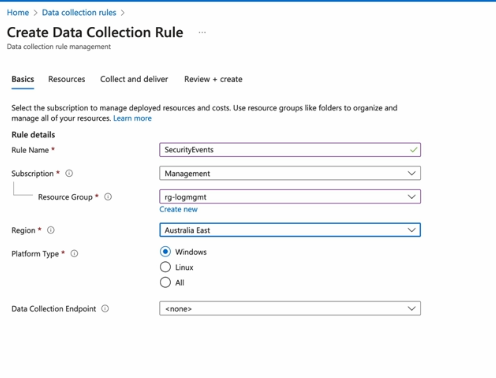

- [overview for AZ500 cirriculum](#overview-for-az500-cirriculum)
- [Azure Security Engineer Associate (AZ-500): Secure Compute, Storage, and Databases](#azure-security-engineer-associate-az-500-secure-compute-storage-and-databases)
- [Azure Security Engineer Associate (AZ-500): Secure Networking](#azure-security-engineer-associate-az-500-secure-networking)
- [Azure Security Engineer Associate (AZ-500): Manage Identity and Access](#azure-security-engineer-associate-az-500-manage-identity-and-access)
- [Azure Security Engineer Associate (AZ-500): Manage Security Operations](#azure-security-engineer-associate-az-500-manage-security-operations)
- [Security Governance](#security-governance)
  - [Governing Azure Resources](#governing-azure-resources)
    - [governance, risk and compliance](#governance-risk-and-compliance)
    - [what is azure policy](#what-is-azure-policy)
    - [azure policy eval](#azure-policy-eval)
    - [policy remediation](#policy-remediation)
      - [managed identities](#managed-identities)
    - [policy structure](#policy-structure)
    - [requirements for managing azure policy](#requirements-for-managing-azure-policy)
    - [azure policy gotchas](#azure-policy-gotchas)
    - [summary:](#summary)
  - [demo: governing resources with Azure Policy](#demo-governing-resources-with-azure-policy)
  - [LAB: Ensuring Compliance with Azure Policies](#lab-ensuring-compliance-with-azure-policies)
    - [Assign Azure Policies](#assign-azure-policies)
    - [Create and Update Resources](#create-and-update-resources)
    - [Observe the Results of Policy Assignment](#observe-the-results-of-policy-assignment)
    - [Remediate Existing Resources](#remediate-existing-resources)
  - [Deploying secure infrastructure](#deploying-secure-infrastructure)
    - [Intro to Azure Blueprints](#intro-to-azure-blueprints)
    - [Lifecycle of a blueprint](#lifecycle-of-a-blueprint)
      - [steps:](#steps)
    - [demo: managing Azure Blueprints](#demo-managing-azure-blueprints)
    - [introducing Azure Landing Zones](#introducing-azure-landing-zones)
    - [summary](#summary-1)
  - [Managing Cloud Security Posture](#managing-cloud-security-posture)
    - [Intro to MSFT defender for Cloud](#intro-to-msft-defender-for-cloud)
    - [Cloud Security Posture Management (CSPM) Plans](#cloud-security-posture-management-cspm-plans)
      - [foundational capabilities](#foundational-capabilities)
      - [the CSPM plan includes: Defender capabilities](#the-cspm-plan-includes-defender-capabilities)
    - [MSFT Cloud Security Benchmark (MCSB)](#msft-cloud-security-benchmark-mcsb)
    - [Exploring CSPM](#exploring-cspm)
    - [summary](#summary-2)
  - [Demo: managing cloud security posture](#demo-managing-cloud-security-posture)
    - [review mgmt group hierarchy](#review-mgmt-group-hierarchy)
    - [config and review Secure Score](#config-and-review-secure-score)
    - [manage regulatory and industry initiatives](#manage-regulatory-and-industry-initiatives)
  - [Customizing security policies](#customizing-security-policies)
    - [why customize security initatives?](#why-customize-security-initatives)
    - [requirements for custom security initiatives](#requirements-for-custom-security-initiatives)
    - [demo: managing custom security initiatives](#demo-managing-custom-security-initiatives)
    - [summary](#summary-3)
  - [securing multi-cloud environments](#securing-multi-cloud-environments)
    - [exploring multicloud security challenges](#exploring-multicloud-security-challenges)
    - [multicloud posture mgmt with MSFT Defender CSPM](#multicloud-posture-mgmt-with-msft-defender-cspm)
    - [demo: Microsoft Defender for Cloud CSPM for AWS](#demo-microsoft-defender-for-cloud-cspm-for-aws)
      - [onboard AWS account o Defender CSPM](#onboard-aws-account-o-defender-cspm)
    - [exploring defender External Attack Surface Management (EASM)](#exploring-defender-external-attack-surface-management-easm)
    - [demo: deploying Defender EASM](#demo-deploying-defender-easm)
    - [summary](#summary-4)
  - [Enabling Cloud Workload Protection (CWP)](#enabling-cloud-workload-protection-cwp)
    - [Cloud workload protection](#cloud-workload-protection)
    - [Microsoft Defender for Servers](#microsoft-defender-for-servers)
    - [Microsoft Defender for Databases](#microsoft-defender-for-databases)
    - [Demo: Enabling multi-cloud workload protection](#demo-enabling-multi-cloud-workload-protection)
      - [enable protection for azure workloads](#enable-protection-for-azure-workloads)
      - [enable database auditing](#enable-database-auditing)
      - [enabled protection for EC2 workloads](#enabled-protection-for-ec2-workloads)
      - [review](#review)
    - [summary](#summary-5)
  - [Responding to Security Governance Issues](#responding-to-security-governance-issues)
    - [your Security Response Toolkit](#your-security-response-toolkit)
    - [role requirements](#role-requirements)
    - [demo: responding to security issues](#demo-responding-to-security-issues)
      - [implement recommendations using quick fixes](#implement-recommendations-using-quick-fixes)
      - [remediation using logic apps](#remediation-using-logic-apps)
      - [automate remediation using workflow automation](#automate-remediation-using-workflow-automation)
    - [summary](#summary-6)
  - [quiz](#quiz)
- [Security Operations](#security-operations)
  - [Introducing Monitoring on Azure](#introducing-monitoring-on-azure)
    - [the importance of monitoring](#the-importance-of-monitoring)
    - [exploring azure monitoring solutions](#exploring-azure-monitoring-solutions)
    - [collecting monitoring data](#collecting-monitoring-data)
    - [retention of monitoring data](#retention-of-monitoring-data)
    - [summary](#summary-7)
  - [configuring monitoring on Azure](#configuring-monitoring-on-azure)
    - [deploying Log Analytics](#deploying-log-analytics)
    - [collecting Logs](#collecting-logs)
    - [demo: configuring Monitoring](#demo-configuring-monitoring)
      - [deploy a log analytics](#deploy-a-log-analytics)
      - [collect Entra ID logs](#collect-entra-id-logs)
      - [collect subscription activity logs](#collect-subscription-activity-logs)
      - [collect a VM security logs](#collect-a-vm-security-logs)
    - [summary](#summary-8)
  - [Monitor Storage for Security Events with Azure Monitor](#monitor-storage-for-security-events-with-azure-monitor)

# overview for AZ500 cirriculum 
* total theory time: 19 hours-ish
* maybe do this as well: https://learn.microsoft.com/en-us/credentials/applied-skills/configure-siem-security-operations-using-microsoft-sentinel/

* some additional resources:
  * https://github.com/timothywarner/az500 <-- this is very big
  * https://github.com/MicrosoftLearning/AZ500-AzureSecurityTechnologies

# Azure Security Engineer Associate (AZ-500): Secure Compute, Storage, and Databases
* https://learn.acloud.guru/course/56ae6de2-b018-4aad-a772-6df24872bde7/overview
* 9.8 hours
  * theory: 5 hours-ish
  * lab: 4 hours 45 mins

# Azure Security Engineer Associate (AZ-500): Secure Networking
* https://learn.acloud.guru/course/a51d0b82-6b77-4800-b49f-a68013bd7d38/overview
* 10.8 hours
  * theory: 4 hours 30 mins-ish
  * lab: 6 hours 15 mins

# Azure Security Engineer Associate (AZ-500): Manage Identity and Access
* https://learn.acloud.guru/course/f60037b4-b11c-4db5-a441-bcef3099b2f1/overview
* 6.5 hours
  * theory: 5 hour 15 mins
  * lab: 1 hour 15 mins

# Azure Security Engineer Associate (AZ-500): Manage Security Operations
* https://learn.acloud.guru/course/3cd18590-8297-461f-a64e-739f5cd2f463/overview
* 8.7 hours
  * theory: 4 hours-ish
  * lab: 4 hours 15 mins

# Security Governance

## Governing Azure Resources

### governance, risk and compliance
* governenance: monitoring, auditing and reporting on security?
* risk: what risks are identified, classified and mitigated?
* compliance: managing industry, regulatory and governments?

### what is azure policy
* azure policy is a tool to enforce standars and assess compliance.
  * Policy Definitions: allowed locations, required Tags
  * Policy Initiative: group of Policy Definitions to provide ease of appliance and reporting
  * Assigned: management groups, subscriptions, resource groups and/or resources
  * Azure Landing Zone: policy in combination with Management Groups provide a structure called Landing Zone
  * Defender for Cloud: 

### azure policy eval
* assignment: assigned policies or initiatives (to scope)
* eval: eval occurs when...
  * a policy or initiative is created and assigned to a scope
  * a resource is created or updated in an assigned scope
  * a policy or initaitive is updated
  * every 24 hours
  * on demand (via CLI or via REST)
* effects:
  * disabled: nothing happens
  * append/modify: bring resource into compliance (modifying)
  * deny: resource creation will be blocked
  * audit/AuditIfNotExists:

### policy remediation
* Bringing a non compliant resource into compliance
* this can occur at policy processing time if the effects `DeployIfNotExists` or `Modify` are used
  * When using `modify`, you can use Azure Monitor, Change Analysis to review the impacts
  * remediate using Remediation Tasks with managed identity that is assigned
    * you can create a managed identity or a managed identity will be created for you

#### managed identities
* managed identities can be assigned to Azure resources
* when a managed identity is created when a policy is created, the managed identity is automatically assigned the necessary roles/rights that are needed for the policy remediation task
* each policy assignment can have a manged identity and additional roles as needed

### policy structure
* make sure you use built-in policy defs regularly
* has a `name` and `description`
* has a `mode`:
  * `indexed`: is used for resources that support locations and tags (these are considered "indexed resources")
  * `all`: used to target all resources
* `parameters`: allow you to create reusable policy defs by makign them customizable when they are deployed
* `policyRule`: define when a policy should apply
* `effect`: define what should happen when a policy applies (when the policyRule evaluates to true)

### requirements for managing azure policy
* creating and assigning policies
  * resource policy contributor
  * security admin
  * owner
* review compliance of policies
  * Reader can review complaince

### azure policy gotchas
* Enforcement of policies: allowed by Azure RBAC, disallowed by Azure Policy
  * Azure Policy wins
* Exclusions vs. exemptions
  * `exclusions` do not eval resources in scope and do not show compliance results (invisible to compliance results).
  * `exempted` resources aren't evaled in scope but show in compliance results (visible to compliance results). <-- this is preferred

### summary:
* Azure Policy is a tool to enforce bueineess rules and assess complaince with those standards.
* A polify definition defines the rules that must be followed and what effects will be applied if the rules are not followed
* policy definitions can be bundled into policy initiatives
* policy definitions can be saved at either the mgmt group or subscription level.
* policies must be assigned to eval the compliacne of resources (scope)
* policies can be assigned to a maangement, subscription, resource group or individual resources
* assigned policies with the `DeployIfNotExists` or `Modify` effect can be remeidated through Remediation Tasks
* the `Resource Policy Contributor` role is a least prived role that can create and assign policies

## demo: governing resources with Azure Policy
* goal: block blob public access on all containers

## LAB: Ensuring Compliance with Azure Policies

### Assign Azure Policies
* login to ARM
* go to the RG> review the managed identity
  
* go to Policy > authoring/Assignments> assign policy
* assign scope and the definition to apply
  
* provide parameters
  
* provide non-compliance message
  
* provide inheritence policy for the above policy specifically
  
* provide parameters
  
* utilize a previously created managed identity
  

### Create and Update Resources
### Observe the Results of Policy Assignment
### Remediate Existing Resources

## Deploying secure infrastructure

### Intro to Azure Blueprints
* Azure Blueprints define a repeatable set of Azure resources so that those resources can be deployed consistently
  * helps deploy a secure infra and helps it remain secure

### Lifecycle of a blueprint
* artifacts included in Blueprints:
  * Resources Groups (and their resource definitions)
  * Policy Assignments
  * Role Assignments
  * ARM Templates

#### steps:
* `Draft`: need `Contributor` access to save to Management Group and/or Subscription
* `Publish`: publish a draft at a hierarchy level as a `Version`
  * can deploy to anywhere in the hierarchy below the Management Group and/or Subscription where the Draft is located
* `Assign`: you assigned your published Blueprint to a scope
  * deployment occurs right away
  * you will need a managed identity

### demo: managing Azure Blueprints
* ARM> blueprint
  * blueprint definitions
  * create
  * built it or blank
  * provide name
  * provide definition location: you can assign a hierarchy level here
* artifacts:
  * add artifact> artifact type:
    * policy assignment
    * role assignment
    * azure resource manager template (subscription)
    * Resource group
      * the location must be the same as the RG
  
* Save Draft
* Publish blueprint: provide version
* assign blueprint: assign a subscription, provide a location, select version
  * lock assignment: creates an RBAC deny assignment (over rides RBAC perms to other users, Blueprint dominates)
* managed identity: as necessary
* Assigned blueprints:
  

### introducing Azure Landing Zones

* probably shouldn't start with Blueprints, but should start with Landing Zones
  * part of the Cloud Adoption Framework
* Azure Landing Zone are templates used to deploy management groups

### summary
* Azure Blueprints are a package of artifacts including RGs, policy assignments, role assignments, and ARM templates
* Azure Blueprints support versioning to update existing infra deployed by Blueprints.
* Blueprints are the only method of creating Azure RBAC deny assignments using locked deployments.
* Azure Landing Zones are the foundation for deployments to Azure and accelerate depoyment of a best-practice deployment architecture.

## Managing Cloud Security Posture

### Intro to MSFT defender for Cloud
* workload lifecycle repeats over and over again
  * pre-deployment: IaC or app code
    * Defender for DevOps: shift-left analysis of protection: protects code, secrets and open source dependencies prior to deployment
  * Deployment: workload deployed to azure, on prem or other clouds
    * CSPM: ongoing compliance management and reporting
  * Post-deployment: persistent app data is generated
    * Cloud workload Protections (CWP): ongoing realtime protection for compute and storage resources

### Cloud Security Posture Management (CSPM) Plans
* scope: azure resources, other clouds (AWS, GCP), on prem
  
#### foundational capabilities
* countinuous discovery and assessment
* security recommendations to fix misconfigs and weaknesses
* Microsoft Cloud Security Benchmark (MCSB) compliance
* An overall Secure Score

#### the CSPM plan includes: Defender capabilities
* Governance (assign responisibility and accountability, timelines)
* Regulatory compliance
* Cloud security explorer
* Attack path analysis
* and more...

### MSFT Cloud Security Benchmark (MCSB)
* provides guidance for securing cloud footprint, securing workloads and securing the data
* combines nest practices and controls into one framework
  * Cloud Adoption Framework, Azure Well-architected fraemwork, and zero trust principles
* includes coverage for: AWS, GCP, and Azure
* can extend controls with industry regulatory controls (PCI, CIS, NIST) and provides for custom initiatives
* provides an overall secure score
  * only Microsoft Cloud Security Benchmark affect secure score (not industry regulatory controls or custom initiatives)
* provides a recommendations page

### Exploring CSPM
* security policy: technical security controls that must be in place for a resource to be compliance
* security initiative: groups of security policies (generally audit only)
  * may be MSFT Cloud Security Benchmark
  * can be applied to mgmt group and subscriptions only
  * recommendations are provided

### summary
* to use the regulatory compliacne or attack path analysis featurs of MSFT defender for Cloud, you will need a Defender Plan enabled
* the MCSB provides a set of best practices and recommendations to help improbe the security of your workloads across Azure, AWS, GCP and on prem
* MSFT Secure Score provides a perncetage that indicates how compliant you are with the recommendations of the MCSB
* Security initaitives are powered by Azure Policy and used to measure compliance against the benchmarks.

## Demo: managing cloud security posture
* managing cloud security posture

### review mgmt group hierarchy
* ARM>search for management groups
* three mgmt groups
* move the subscription into another mgmt group
* ARM> search for Microsoft Defender for Cloud
* Review the overview pane

### config and review Secure Score
* ARM> search for Microsoft Defender for Cloud
* Management/Environment Settings
  * can add environments here
  * should automatically make visible the Azure mgmt groups and subscriptions
    * if you wish to onboard Azure subscriptions, you can go to the subscription ellipses and click Edit settings
      * Default assignment enforces policy and uses the MCSB
* ARM> search for Microsoft Defender for Cloud
  * review Cloud Security/Security posture to review the security posture
  * review recommendations
    

### manage regulatory and industry initiatives
* ARM> search for Microsoft Defender for Cloud
* Management/Environment Settings
  * can add environments here
* on the Subscription ellipses and click Edit settings
* under industry standards, review, select and Add
* ARM> search for Microsoft Defender for Cloud
  * review Cloud Security/Regulatory compliance to review the the regulatory compliance
    * regulatory compliance analysis is not free.  You can scope a license by Azure Subscription. (initially you can continue without installing agents)
* review Environment settings
  * navigate into Subscription and validate that CSPM billing has been enabled
    
* verify industry initiative
  * 
* Can download compliance reports and view compliance over time
  

## Customizing security policies

### why customize security initatives?
* built in regulatory or industry standarsd aren't provided for you industry
  * GDPR isn't included, for example
* individual organization policy requirements
* Reporting on contractual requirements

### requirements for custom security initiatives
* creating a custom security initiatives
  * `resource policy contributor`, `security admin` or `owner` role is required at scope
  * as per the last section, you must **store** the definition accessible at scope (mgmt group or subscription)
* assigning a custom security initiative
  * `resource policy contributor` (to audit but not commit changes), `security admin` or `owner` role is required at scope
  * as per the last section, you must **apply** the definition accessible at scope (mgmt group or subscription)
* managing compliance in Defender for Cloud
  * `security reader` role can review compliance
  * `security admin` role can also create resource exemptions
  * applying security recommendations requires at least the `Contributor` role

### demo: managing custom security initiatives
* login to ARM> Defender for cloud> management/environment settings
* expand hierarchy> settings for mgmt group
* Add customer initiative
* new initiative
  * initiative location (as high in the hierarchy as possible)
  * add policy definitions:
    
  * controls: help group policies when using initiatives
* Click Add
  * review scope, policy enforcement
* wait while the audit occurs
* the compliance reports for custom initiative are stored within Defender for cloud/cloud security/regulatory compliance pane
  

### summary
* custom security initiatives allow you to measure and report on compliance for your specific requirements
* your customr security initatives must be both defined and assigned to a subscription or mgmt group
* `resource policy contributor` role is the least-rpived azure role that can create and assign customer security initiatives

## securing multi-cloud environments

### exploring multicloud security challenges
* Azure, AWS, GCP, on prem are covered
* Microsoft Defender for Cloud has an integration that will handle multicloud visibility and assessment:
  * MSFT Defender External Attack Surface Management (EASM)
    * determine the attack surface for yoru entire org that is susceptible to attack from an external source
  * MSFT Defender CSPM: ongoing compliance mgmt and reporting across Azure, AWS, and GCP

### multicloud posture mgmt with MSFT Defender CSPM
* requirements are as follows
  * AWS:
    * Azure subscription, and RG will store AWS connector resource 
    * `Contributor` privs to subscription where RG lives
    * AWS account
    * `administrator` perms in AWS
    * deploy using CloudFormation or Terraform
  * GCP:
    * Azure subscription, and RG will store AWS connector resource 
    * `Contributor` privs to subscription where RG lives
    * A GCP project or organization
    * `owner` privs in GCP
    * deploy using GCP Cloud Shell or Terraform
* different levels of protection are supported:
  * foundational CSPM plan
  * defender CSPM plan

### demo: Microsoft Defender for Cloud CSPM for AWS
#### onboard AWS account o Defender CSPM
* login to ARM> defender> Management/environment settings> Add env> Amazon Web Services
  * Connector name
  * single account or mgmt account?
  * select AWS regions in scope
  * assign the location and mgmt location for the AWS Connector resource
  * AWS account ID:
* Config AWS account ID
  
* select the plan: foundational or Defender
  
* download deployment IaC either in CloudFormation or Terraform
  
* deploy into AWS via CloudFormation
  
  * provide name for stack
  * accept defaults
* to gather all info on AWS, it will take time (60+ mins possibly)
* Review the standards implemented:
  
* review results
  
  

### exploring defender External Attack Surface Management (EASM)
* answers question: whta is the attack surface?
* Deploy: in Azure, deploy EASM resource (requires `Contributor` level access)
* Initial seed: provide an initial seed of data, or use data MSFT already knows about your company
* Inventory: defender EASM will generate an inventory for you to review
* Analysis: EASM will analyze your assets for security information and potential security issues

### demo: deploying Defender EASM
* login to ARM> EASM> create workspace> access EASM workspace resource that was created
* in Overview, you can try to locate your company by name, if not listed, you can "Create a customer attack surface"
  
* provide initial seed data:
  
* the scan will take 24-48 hours
* Review:
  * Attack Surface Summary
  * Security Posture

### summary
* CSPM provides compliance reporting for multi cloud envs (inc. AWS and GCP)
  * to setup the CSPM connector:
    * AWS: need `Administrator` perms
    * GCP: need `Owner` privs
* EASM: allows you to inventory and build a complete picture of your external attack surface with dependencies and vulnerabilities

## Enabling Cloud Workload Protection (CWP)

### Cloud workload protection
* Microsoft Defender Cloud Workload Protections: provides visibility for workloads across Azure resources and multiple clouds (across AWS, GCP, on prem, Azure)
  * Defender for Servers: integrates to Defender for Endpoint to provide EPP and response (EDR)
  * Defender for Storage: blob and datalake with standard and premium tiers, protect against sensative data and virus (no support for v1 accounts, and queues and table).  Supports Files via activity monitoring.
  * Defender for Databases: Azure SQL DBs and SQL management Instance are in scope, SQL VMs anywhere, OSS databases in PaaS and Cosomose
  * Defender for Containers: AKS ACR, AWS: EKS, ECR, GCP: GKE, on-prem: arc-enabled k8s clusters

### Microsoft Defender for Servers
* plan 1
  * must be enabled at the subscription level
  * includes Defender for Endpoint license (and auto provisioning)
* plan 2
  * must be enabled at the subscription and Log Analytics Workspace level
  * includes:
    * adaptive app controls (allow controls per machines)
    * Qualys vuln scanning
    * FIM (Files and registry)
* additional requirements: Log Analytics workspace and agents deployed to servers

### Microsoft Defender for Databases
* Microsoft Defender for...
  * SQL:
    * express configs is enabled at the subscription or server level.
    * classic config is enabled at the subscription or server level and supports more databases but requires a storage account (supports Azure SQL Database, Azure managed instance, and Azure Synapse analytics)
  * Open source RDBMS:
    * enable at the resource level only
    * supports PaaS levels
  * MSSQL on VMs:
    * enabled at the Log Analytics workspace level
    * SQL server 2012 R2 and later
  * Cosmos DB for NoSQL:
    * Enabled at subscription or resource level
    * Only suppoorts Cosmos DB for NoSQL (no cassandra, etc)

### Demo: Enabling multi-cloud workload protection
#### enable protection for azure workloads
* login to ARM> Defender for Cloud> management> Env settings> expand hierarchy> enable
  
  * databases allow for selecting types
    

#### enable database auditing
* If you navigate to an SQL resource instance> security/Microsoft Defender for Cloud
  

#### enabled protection for EC2 workloads
* login to ARM> Defender for Cloud> management> Env settings> expand hierarchy> find AWSAccount> enable
  

#### review
* Defender for Cloud> Cloud Security/Workload protections
  

### summary
* defender for services plan 2: provides adaptive app controls, qualys vuln scanning and FIM
* a Log Analytics workspace is required for Defender for Servers and Defender for SQL on VMs
* Defender for OSS RDBMS is enabled at the resource level only
* Defender for Cosmos DB only supports the NoSQL API

## Responding to Security Governance Issues

### your Security Response Toolkit
* CSPM: makes security recommendations results in...
  * Recommendations:
    * can disable CSPM policy (can't be done for regulatory frameworks)
    * can exemptions to CSPM policies (can be applied to resource, subscription or mgmt group)
      * "risk acceptance" or risk mitigation
    * can remediate
      * can fix manually or quick fix
      * can trigger a logic app
    * can enforce/deny violators given the content of the finding
      * `deny` is a hard block
      * `enforce` is `DeployIfNotExists` to bring net new resources into compliance
* CWP: advanced protection capabilities allow alerts to be created when threats in the protected workloads are identified (covers azure, on prem, and multicloud)
  * security alerts:
    * inspect: the resource in context (review logs)
    * mitigate: alert provides mitigation steps
    * prevent: review and reduce attack surface
    * automate: trigger an automatic response (LogicApp)
    * suppress: similar alerts
* CSPM recommendations and CWP alerts should be fed into a SIEM (like MSFT Sentinel or third parties via Event Hubs)

### role requirements

| function | role |
|--------------|-----------|
| disable a security recommendation | `security admin`: update security policy and dismiss alerts |
| exempting resources and recommends | `owner` or `resource policy contributor` | 
| managing alerts | `security admin` (globally) or resource specific roles (ie: `SQL security manager`) |
| create and manage suppression rules | `security admin` or `owner` (globally) |
| automating responses to recommendations and alerts | `security admin` or `owner` (use existing logicapp), or `logic app contributor` (create new logic app) |

### demo: responding to security issues

#### implement recommendations using quick fixes

* login to ARM> Defender for Cloud> General/recommendations > review a specific recommendation, on the right side, note the lightning bolt.
  
  * lightning bolt indicates there's a "quick fix" available.
  
  

#### remediation using logic apps
* note there is no lightning bolt
  
* You can exempt or trigger logic app
  
  * logic apps
    
    * MSFT publishes logic apps to github for example: https://github.com/Azure/Microsoft-Defender-for-Cloud/tree/main/Remediation%20scripts/Management%20ports%20of%20virtual%20machines%20should%20be%20protected%20with%20just-in-time%20network%20access%20control
    

#### automate remediation using workflow automation
* defender for cloud> management/workflow automation
  
* recommendation state: "unhealthy"
* can use azure policy to deploy workflow automations across multiple subscriptions

### summary
* CSPM generates recommendations
  * in response to recommenddations you can use enforce or deny actions to prevent reoccurence
* CWP generate security alerts
* for both recommendations and alerts, use workflow automation to prevent reoccurence
* workflow automation is powered by azure logic apps

## quiz
* Assigned policies with the DeployIfNotExists or Modify effects can be remediated through remediation tasks.
* Which scopes can Azure policy/initiative assignment exclusions include?
  * Policy/initiative assignment exclusions can also include management groups, subscriptions, resource groups, and resources.
* Which Azure role is the least-privileged role that can create and assign custom security initiatives?
  * Resource Policy Contributor is the least-privileged Azure role that can create and assign custom security initiatives.

# Security Operations

## Introducing Monitoring on Azure

### the importance of monitoring

* Zero trust creates a need to deal with attack management
  * you aim to reduce threats rather than avoiding them completely
  * you leverage tight monitoring in order to detect threats quickly
* observe, measure and take action
* Azure Monitor, Microsoft Defender for Cloud and Sentinel

### exploring azure monitoring solutions
* log analytics workspace stores all telemetry
  * inside log analytics workspace data is stored in tables
* Log analytics workspace access modes:
  * workspace-context permissions
  * resource-context permissions: provide access to data based on the access a users has access to resources in Azure

### collecting monitoring data

* collecting data:
  * Application Insights: codeless or SDK
  * Agents + data collection rules
  * Platform logs: Azure resources (subscriptions and tenant)
  * Custom Logs
* analysis tools:
  * logs, metrics, change analysis,traces
* insights and visualizations:
  * workbooks, dashboards, Power BI
* respond:
  * alerting

### retention of monitoring data
* compliance may indicate a retention period
* Log Analytics Workspace:
  * default retention is 31 days
  * Application Inishgts, Activity Log data, and Usage data is retained for 90 days.
  * Enabling Microsoft Sentinel on a workspace increases the default no-chagne retention to 90 days for all data.
  * maximum workspace retention is configurable up to 730 days (2 years)
  * Individual tables can also be configured with archiving for up to 7 years
  * export to an Azure Storage Account for immutable logs or increaes redundancy
  * Intgrate with third party solutions using Azure Event Hubs

### summary
* log Analytics workspaces storeage data for Defender for Cloud, Sentinel and Azure monitor
* The resource-context Log Analytics workspace access mode provides access to logs based on resource access
* Log Analytics worksapces can storage data from 31 days upt o 730 days
* Individual tables in a workspace can store data up to 7 years.
* For immurtable logs, export data to a storage account

## configuring monitoring on Azure

### deploying Log Analytics
* Consider how many worksapces you require and where the workspaces should be placed geographically
  * suggested to have a single Log Analytics Worksapce
* to deploy a Log Analytics workspace, you need the `Log Analytics Contributor` role or a more-prived role.
* `Log analytics Contributor` role and more prived roles can also eidt monitoring settings for Azure resources

### collecting Logs
* consider the Azure hierarchy as it relates to configuring sending logs
* Entra ID tenant
  * Diagnostic Settings can be configed to send activity to Log Analytics Workspace
  * can send to Storage Account or Event Hubs
  * Subscriptions
    * Diagnostic Settings can be configed to send activity to Log Analytics Workspace
    * can send to Storage Account or Event Hubs
    * Resources Groups
      * Diagnostic Settings can be configed to send activity to Log Analytics Workspace
      * can send to Storage Account or Event Hubs
      * PaaS
        * Control Plane
          * Diagnostic Settings can be configed to send activity to Log Analytics Workspace
          * can send to Storage Account or Event Hubs
        * Data Plane:
          * Diagnostic Settings can be configed to send activity to Log Analytics Workspace
          * can send to Storage Account or Event Hubs
      * IaaS
        * OS instances
          * Send via Azure Monitor Agent to Data collection rules to Log Analytics workspace
        * Applications to Application Insights to Log Analytics workspace

### demo: configuring Monitoring

#### deploy a log analytics
* login to ARM> Log Analytics Worksapce> create> name

#### collect Entra ID logs
* go to Entra ID> Monitoring\Diagnostic settings
  * add diagnostic setting
    

#### collect subscription activity logs
* resource search bar> go to Subscriptions, select a subscription
* go to Activity Log, then Export Activity Logs
  * add diagnostic setting
    

#### collect a VM security logs
* resource search bar> go to Log Analytics Workspace > SEttings/Agents
  
* resource search bar> go to data collection rule> create
   
   * select jsut a VM:
     
  * Select Collect and delivery
    * 
    * Note that you will have to make a modification to the VM(s) themselves to forward all the logs you'd like
  

### summary
* `Log Analytics Contributor` role can deploy a Log Analytics Workspace and config monitoring for all Azure resources
* Collecting tenant, activity and resource logs requires diagnostics settings to be configured
* Collecting logs from an Azure VM or server outside of Azure requires the deployment of an Agent and the config of data collection rules

## Monitor Storage for Security Events with Azure Monitor
* https://learn.acloud.guru/course/3cd18590-8297-461f-a64e-739f5cd2f463/learn/7a446f29-b533-45ae-b588-fd6bf0ed8363/840af115-c461-44e8-a2bd-af005b9d8696/lab/840af115-c461-44e8-a2bd-af005b9d8696