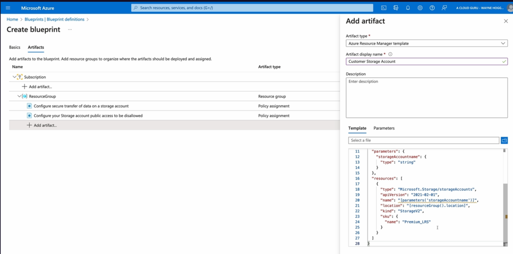
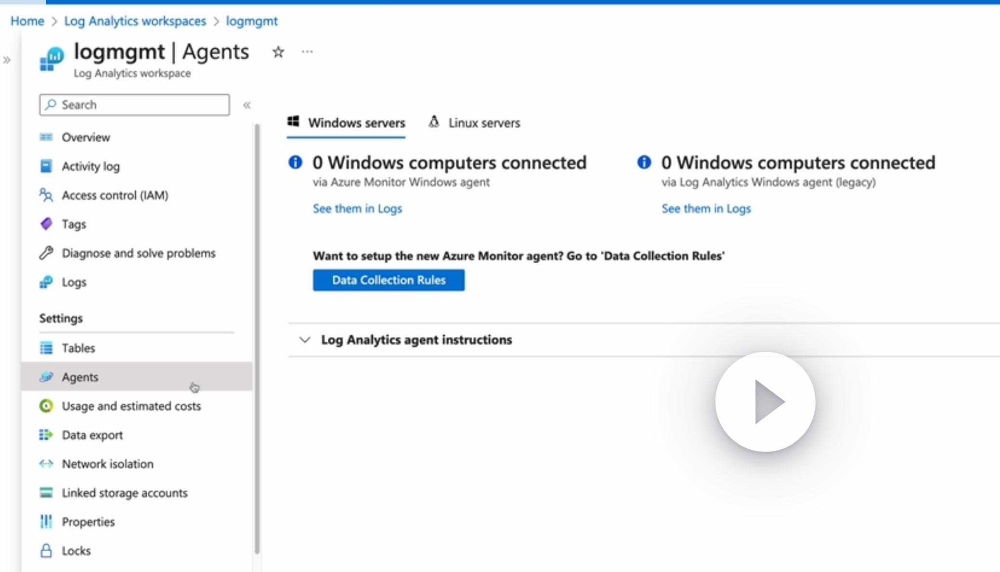
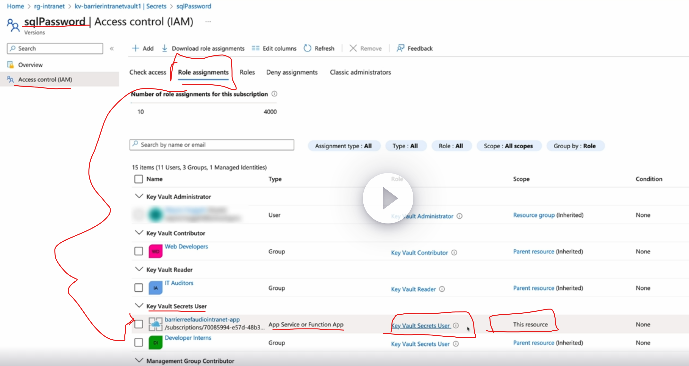
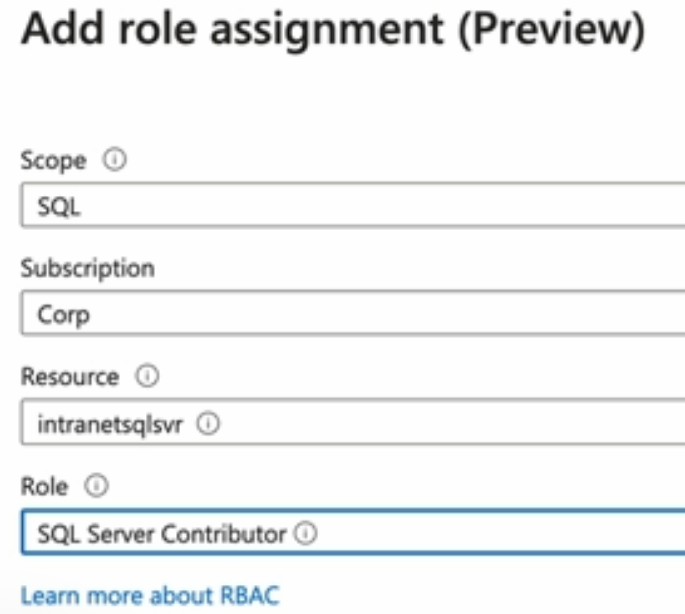
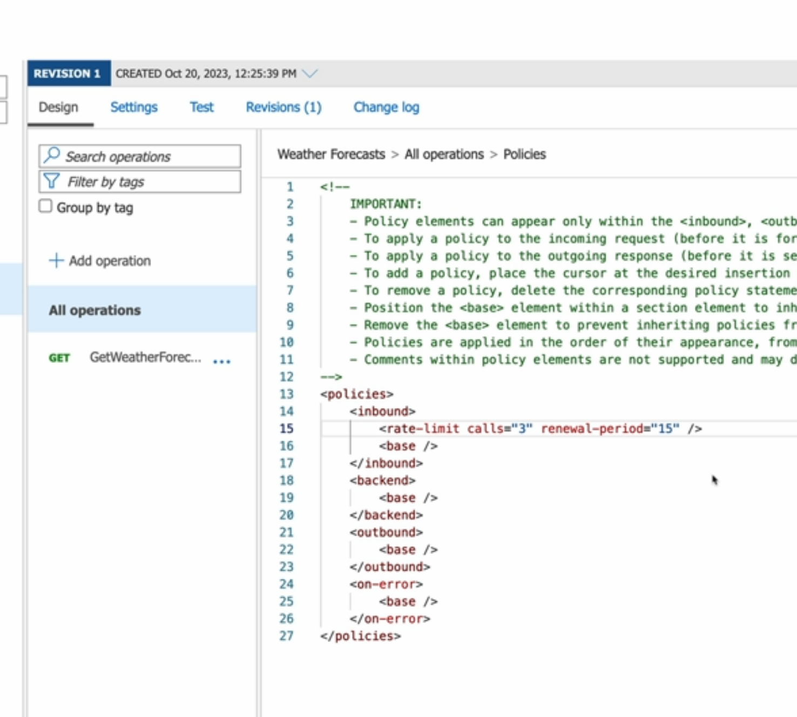
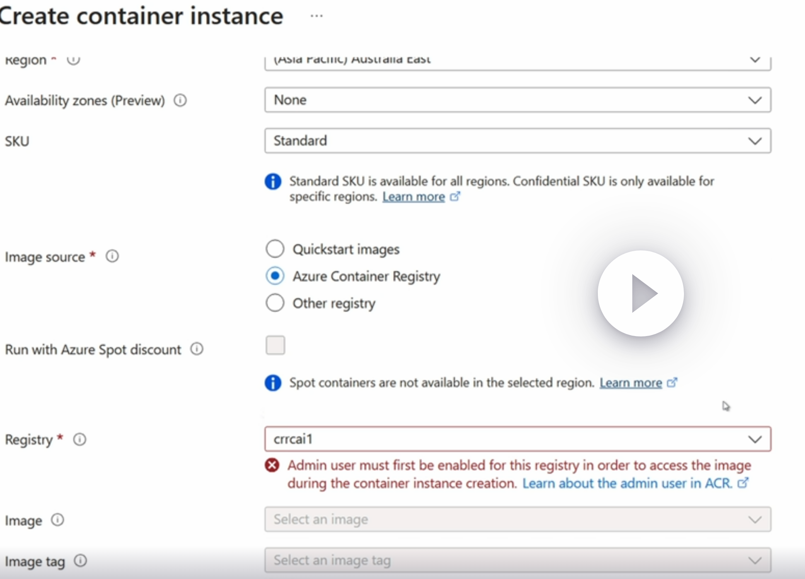
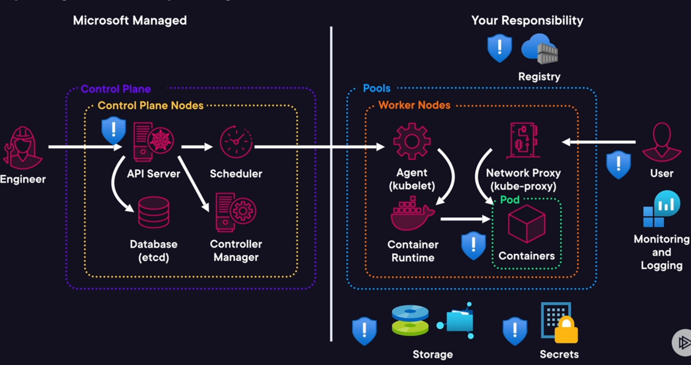
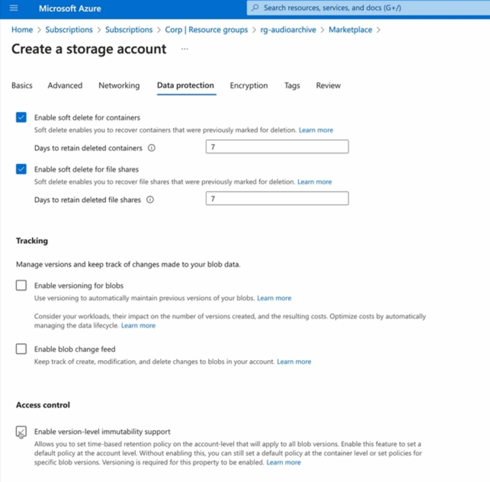

- [overview for AZ500 cirriculum](#overview-for-az500-cirriculum)
  - [Azure Security Engineer Associate (AZ-500): Manage Identity and Access](#azure-security-engineer-associate-az-500-manage-identity-and-access)
- [Azure Security Engineer Associate (AZ-500): Manage Security Operations](#azure-security-engineer-associate-az-500-manage-security-operations)
- [Security Governance](#security-governance)
  - [Governing Azure Resources](#governing-azure-resources)
    - [governance, risk and compliance](#governance-risk-and-compliance)
    - [what is azure policy](#what-is-azure-policy)
    - [azure policy eval](#azure-policy-eval)
    - [policy remediation](#policy-remediation)
      - [managed identities](#managed-identities)
    - [policy structure](#policy-structure)
    - [requirements for managing azure policy](#requirements-for-managing-azure-policy)
    - [azure policy gotchas](#azure-policy-gotchas)
    - [summary:](#summary)
  - [demo: governing resources with Azure Policy](#demo-governing-resources-with-azure-policy)
  - [LAB: Ensuring Compliance with Azure Policies](#lab-ensuring-compliance-with-azure-policies)
    - [Assign Azure Policies](#assign-azure-policies)
    - [Create and Update Resources](#create-and-update-resources)
    - [Observe the Results of Policy Assignment](#observe-the-results-of-policy-assignment)
    - [Remediate Existing Resources](#remediate-existing-resources)
  - [Deploying secure infrastructure](#deploying-secure-infrastructure)
    - [Intro to Azure Blueprints](#intro-to-azure-blueprints)
    - [Lifecycle of a blueprint](#lifecycle-of-a-blueprint)
      - [steps:](#steps)
    - [demo: managing Azure Blueprints](#demo-managing-azure-blueprints)
    - [introducing Azure Landing Zones](#introducing-azure-landing-zones)
    - [summary](#summary-1)
  - [Managing Cloud Security Posture](#managing-cloud-security-posture)
    - [Intro to MSFT defender for Cloud](#intro-to-msft-defender-for-cloud)
    - [Cloud Security Posture Management (CSPM) Plans](#cloud-security-posture-management-cspm-plans)
      - [foundational capabilities](#foundational-capabilities)
      - [the CSPM plan includes: Defender capabilities](#the-cspm-plan-includes-defender-capabilities)
    - [MSFT Cloud Security Benchmark (MCSB)](#msft-cloud-security-benchmark-mcsb)
    - [Exploring CSPM](#exploring-cspm)
    - [summary](#summary-2)
  - [Demo: managing cloud security posture](#demo-managing-cloud-security-posture)
    - [review mgmt group hierarchy](#review-mgmt-group-hierarchy)
    - [config and review Secure Score](#config-and-review-secure-score)
    - [manage regulatory and industry initiatives](#manage-regulatory-and-industry-initiatives)
  - [Customizing security policies](#customizing-security-policies)
    - [why customize security initatives?](#why-customize-security-initatives)
    - [requirements for custom security initiatives](#requirements-for-custom-security-initiatives)
    - [demo: managing custom security initiatives](#demo-managing-custom-security-initiatives)
    - [summary](#summary-3)
  - [securing multi-cloud environments](#securing-multi-cloud-environments)
    - [exploring multicloud security challenges](#exploring-multicloud-security-challenges)
    - [multicloud posture mgmt with MSFT Defender CSPM](#multicloud-posture-mgmt-with-msft-defender-cspm)
    - [demo: Microsoft Defender for Cloud CSPM for AWS](#demo-microsoft-defender-for-cloud-cspm-for-aws)
      - [onboard AWS account o Defender CSPM](#onboard-aws-account-o-defender-cspm)
    - [exploring defender External Attack Surface Management (EASM)](#exploring-defender-external-attack-surface-management-easm)
    - [demo: deploying Defender EASM](#demo-deploying-defender-easm)
    - [summary](#summary-4)
  - [Enabling Cloud Workload Protection (CWP)](#enabling-cloud-workload-protection-cwp)
    - [Cloud workload protection](#cloud-workload-protection)
    - [Microsoft Defender for Servers](#microsoft-defender-for-servers)
    - [Microsoft Defender for Databases](#microsoft-defender-for-databases)
    - [Demo: Enabling multi-cloud workload protection](#demo-enabling-multi-cloud-workload-protection)
      - [enable protection for azure workloads](#enable-protection-for-azure-workloads)
      - [enable database auditing](#enable-database-auditing)
      - [enabled protection for EC2 workloads](#enabled-protection-for-ec2-workloads)
      - [review](#review)
    - [summary](#summary-5)
  - [Responding to Security Governance Issues](#responding-to-security-governance-issues)
    - [your Security Response Toolkit](#your-security-response-toolkit)
    - [role requirements](#role-requirements)
    - [demo: responding to security issues](#demo-responding-to-security-issues)
      - [implement recommendations using quick fixes](#implement-recommendations-using-quick-fixes)
      - [remediation using logic apps](#remediation-using-logic-apps)
      - [automate remediation using workflow automation](#automate-remediation-using-workflow-automation)
    - [summary](#summary-6)
  - [quiz](#quiz)
- [Security Operations](#security-operations)
  - [Introducing Monitoring on Azure](#introducing-monitoring-on-azure)
    - [the importance of monitoring](#the-importance-of-monitoring)
    - [exploring azure monitoring solutions](#exploring-azure-monitoring-solutions)
    - [collecting monitoring data](#collecting-monitoring-data)
    - [retention of monitoring data](#retention-of-monitoring-data)
    - [summary](#summary-7)
  - [configuring monitoring on Azure](#configuring-monitoring-on-azure)
    - [deploying Log Analytics](#deploying-log-analytics)
    - [collecting Logs](#collecting-logs)
    - [demo: configuring Monitoring](#demo-configuring-monitoring)
      - [deploy a log analytics](#deploy-a-log-analytics)
      - [collect Entra ID logs](#collect-entra-id-logs)
      - [collect subscription activity logs](#collect-subscription-activity-logs)
      - [collect a VM security logs](#collect-a-vm-security-logs)
    - [summary](#summary-8)
  - [LAB: Monitor Storage for Security Events with Azure Monitor](#lab-monitor-storage-for-security-events-with-azure-monitor)
    - [Configure Diagnostic Settings](#configure-diagnostic-settings)
    - [Perform Anonymous Access to Container](#perform-anonymous-access-to-container)
    - [query Azure Monitor Logs](#query-azure-monitor-logs)
    - [Create an Azure Monitor Alert:](#create-an-azure-monitor-alert)
  - [Introducing Microsoft Sentinel](#introducing-microsoft-sentinel)
    - [what is MSFT sentinel](#what-is-msft-sentinel)
    - [how does sentinel work](#how-does-sentinel-work)
    - [managing access to sentinel](#managing-access-to-sentinel)
    - [summary](#summary-9)
  - [Collecting SEcurity Events](#collecting-security-events)
    - [exploring data collection](#exploring-data-collection)
    - [demo: config data collection](#demo-config-data-collection)
    - [summary](#summary-10)
  - [Responding to Security Threats](#responding-to-security-threats)
    - [your responder toolkit](#your-responder-toolkit)
    - [demo: responding to security incidents](#demo-responding-to-security-incidents)
      - [give sentinel permissions to run playbook](#give-sentinel-permissions-to-run-playbook)
      - [create a playbook](#create-a-playbook)
      - [create an analytics rule](#create-an-analytics-rule)
    - [summary](#summary-11)
  - [LAB: Investigate Windows Security Events with Microsoft Sentinel](#lab-investigate-windows-security-events-with-microsoft-sentinel)
    - [Deploy Microsoft Sentinel (to log analytics workspace)](#deploy-microsoft-sentinel-to-log-analytics-workspace)
    - [Add the Windows Security Events Solution](#add-the-windows-security-events-solution)
    - [Configure Data Connector](#configure-data-connector)
    - [Configure Analytics Rules](#configure-analytics-rules)
    - [Simulate Security Events](#simulate-security-events)
    - [Investigate the Incidents](#investigate-the-incidents)
  - [quiz](#quiz-1)
- [Managing Secrets](#managing-secrets)
  - [Deploying secret storage using Azure Key Vault](#deploying-secret-storage-using-azure-key-vault)
    - [What is Azure Key Vault](#what-is-azure-key-vault)
    - [why use Azure Key Vault](#why-use-azure-key-vault)
    - [types of secrets](#types-of-secrets)
    - [key vault services and tiers](#key-vault-services-and-tiers)
    - [demo: create an Azure Key Vault](#demo-create-an-azure-key-vault)
    - [summary](#summary-12)
  - [Managing access to Azure Key Vault](#managing-access-to-azure-key-vault)
    - [accessing key vault](#accessing-key-vault)
    - [configuring network access](#configuring-network-access)
    - [authorizing key vault access](#authorizing-key-vault-access)
    - [providing resource access to key vaults](#providing-resource-access-to-key-vaults)
    - [demo: managing key vault access](#demo-managing-key-vault-access)
      - [enable private endpoint for key vault](#enable-private-endpoint-for-key-vault)
      - [review access models](#review-access-models)
      - [configure Entra RBAC](#configure-entra-rbac)
    - [summary](#summary-13)
  - [Managing Azure Key Vault Secrets](#managing-azure-key-vault-secrets)
    - [exploring secrets and keys](#exploring-secrets-and-keys)
    - [Rotating secrets and keys](#rotating-secrets-and-keys)
      - [rotating secrets](#rotating-secrets)
      - [rotating keys](#rotating-keys)
    - [demo: configuring automatic secret rotation](#demo-configuring-automatic-secret-rotation)
    - [summary](#summary-14)
  - [Protecting Key Vault Secrets](#protecting-key-vault-secrets)
    - [protecting against secret deletion](#protecting-against-secret-deletion)
    - [understanding retention and recovery](#understanding-retention-and-recovery)
    - [key vault backup and restore](#key-vault-backup-and-restore)
    - [demo: protect vaults and secrets](#demo-protect-vaults-and-secrets)
    - [summary](#summary-15)
  - [LAB: Securely Access Script Secrets in Azure Key Vault](#lab-securely-access-script-secrets-in-azure-key-vault)
  - [quiz](#quiz-2)
- [Azure Security Engineer Associate (AZ-500): Secure Compute, Storage, and Databases](#azure-security-engineer-associate-az-500-secure-compute-storage-and-databases)
- [Securing compuite and applications](#securing-compuite-and-applications)
  - [securing access to VMs](#securing-access-to-vms)
    - [how to do this:](#how-to-do-this)
    - [Selection a Bastion SKU](#selection-a-bastion-sku)
    - [requirements to deploy Bastion](#requirements-to-deploy-bastion)
    - [demo: using Bastion](#demo-using-bastion)
    - [Summary](#summary-16)
  - [Providing temporary access to VMs (via Just-in-Time VM access)](#providing-temporary-access-to-vms-via-just-in-time-vm-access)
    - [JIT VM access requirements](#jit-vm-access-requirements)
    - [demo: configure JIT VM access](#demo-configure-jit-vm-access)
    - [summary](#summary-17)
  - [securing Azure API Management service](#securing-azure-api-management-service)
    - [Exploring Azure API mgmt](#exploring-azure-api-mgmt)
    - [securing APIs](#securing-apis)
    - [demo:](#demo)
    - [summary](#summary-18)
    - [additional resources:](#additional-resources)
  - [securing Azure Container registry](#securing-azure-container-registry)
    - [intro to containerized apps](#intro-to-containerized-apps)
    - [managing access to ACR](#managing-access-to-acr)
    - [use cases for ACR actions](#use-cases-for-acr-actions)
    - [demo: securing ACR](#demo-securing-acr)
      - [create ACR](#create-acr)
      - [grant perms to access ACR](#grant-perms-to-access-acr)
      - [create and push container image ( access ACR as a user principal)](#create-and-push-container-image--access-acr-as-a-user-principal)
      - [access ACR as a service principal](#access-acr-as-a-service-principal)
    - [summary](#summary-19)
  - [securing Azure Container instances](#securing-azure-container-instances)
    - [comparing container deployment options](#comparing-container-deployment-options)
    - [Securing container workloads](#securing-container-workloads)
    - [demo: securing ACI](#demo-securing-aci)
      - [review security concerns](#review-security-concerns)
      - [secure container secrets with Key Vault](#secure-container-secrets-with-key-vault)
      - [deploy ACI using ACR](#deploy-aci-using-acr)
      - [leverage a managed identity to access the key vault](#leverage-a-managed-identity-to-access-the-key-vault)
    - [summary](#summary-20)
  - [securing Azure Container Apps](#securing-azure-container-apps)
    - [exploring azure container apps security configuration](#exploring-azure-container-apps-security-configuration)
    - [demo: securing Azure Container Apps](#demo-securing-azure-container-apps)
      - [create container app environemtn](#create-container-app-environemtn)
      - [create Azure container app](#create-azure-container-app)
      - [use the container app's system-assigned managed identity/service principal to pull from the ACR:](#use-the-container-apps-system-assigned-managed-identityservice-principal-to-pull-from-the-acr)
      - [use the container app's system-assigned managed identity/service principal to read from a Key Vault:](#use-the-container-apps-system-assigned-managed-identityservice-principal-to-read-from-a-key-vault)
      - [config diagnostic settings for the Container App Environment](#config-diagnostic-settings-for-the-container-app-environment)
    - [summary](#summary-21)
  - [securing Azure Kubernetes Service (AKS)](#securing-azure-kubernetes-service-aks)
    - [Explore AKS Security configuration](#explore-aks-security-configuration)
    - [what is our focus to secure?](#what-is-our-focus-to-secure)
    - [summary](#summary-22)
  - [monitoring AKS](#monitoring-aks)
    - [exploring AKS monitoring](#exploring-aks-monitoring)
    - [AKS monitoring requirements](#aks-monitoring-requirements)
    - [demo: configuring logging on the AKS](#demo-configuring-logging-on-the-aks)
      - [create Log Analytics Workspace](#create-log-analytics-workspace)
      - [Create an Azure Monitor Workspace](#create-an-azure-monitor-workspace)
      - [Create a Managed Grafana Workspace](#create-a-managed-grafana-workspace)
      - [Create a Kubernetes Cluster using the Portal](#create-a-kubernetes-cluster-using-the-portal)
      - [Config monitoring using azcli](#config-monitoring-using-azcli)
      - [view monitoring and dashboards](#view-monitoring-and-dashboards)
    - [summary](#summary-23)
  - [Managing authentication for AKS](#managing-authentication-for-aks)
    - [explorer AKS Authentication and Authorization](#explorer-aks-authentication-and-authorization)
      - [built in roles:](#built-in-roles)
      - [role types in AKS clusters](#role-types-in-aks-clusters)
      - [key points:](#key-points)
    - [AKS Identity best practices](#aks-identity-best-practices)
    - [demo: create an AKS cluster with AKS managed MSFT Entra integration](#demo-create-an-aks-cluster-with-aks-managed-msft-entra-integration)
      - [create an AKS Administrators group in Entra ID](#create-an-aks-administrators-group-in-entra-id)
      - [create new AKS cluster](#create-new-aks-cluster)
      - [Grant the AKS Administrators group access to the k8s cluster API](#grant-the-aks-administrators-group-access-to-the-k8s-cluster-api)
      - [verify local accounts are disabled and access k8s cluster API](#verify-local-accounts-are-disabled-and-access-k8s-cluster-api)
    - [summary](#summary-24)
  - [Securing AKS networking](#securing-aks-networking)
    - [securing access to the k8s Cluster API](#securing-access-to-the-k8s-cluster-api)
      - [Network access control](#network-access-control)
    - [understanding Container Network Interface (CNI) plugins](#understanding-container-network-interface-cni-plugins)
    - [choosing a network plugin](#choosing-a-network-plugin)
    - [controlling inbound network traffic](#controlling-inbound-network-traffic)
      - [`Services`](#services)
      - [`Ingress`](#ingress)
    - [controlling network traffic between pods](#controlling-network-traffic-between-pods)
    - [demo: Secure AKS Networking](#demo-secure-aks-networking)
      - [create a private cluster](#create-a-private-cluster)
      - [create a public cluster wiht restricted network access](#create-a-public-cluster-wiht-restricted-network-access)
    - [summary](#summary-25)
  - [quiz](#quiz-3)
- [Securing Storage](#securing-storage)
  - [Securing VM data](#securing-vm-data)
    - [protecting VM Disks](#protecting-vm-disks)
    - [ADE requirements and restrictions](#ade-requirements-and-restrictions)
    - [demo: enable ADE](#demo-enable-ade)
      - [explore the security concerns](#explore-the-security-concerns)
      - [Enable ADE on a VM](#enable-ade-on-a-vm)
    - [summary](#summary-26)
  - [LAB: Applying Azure Disk Encryption to a Windows Virtual Machine](#lab-applying-azure-disk-encryption-to-a-windows-virtual-machine)
  - [Securing access to Storage Account](#securing-access-to-storage-account)
    - [accessing Azure Storage Services](#accessing-azure-storage-services)
    - [authorizing acess to azure storage](#authorizing-acess-to-azure-storage)
    - [managing storage Account Keys](#managing-storage-account-keys)
    - [authorizing access with SAS](#authorizing-access-with-sas)
    - [authorization with Azure RBAC](#authorization-with-azure-rbac)
    - [summary](#summary-27)
  - [Secure access to Azure Blob Storage](#secure-access-to-azure-blob-storage)
    - [Authorizing Access to Blob Storage](#authorizing-access-to-blob-storage)
    - [demo: securing access to blob services](#demo-securing-access-to-blob-services)
      - [review storage account RBAC](#review-storage-account-rbac)
      - [review storage account keys](#review-storage-account-keys)
      - [create account SAS](#create-account-sas)
      - [create services SAS or user delegation SAS](#create-services-sas-or-user-delegation-sas)
      - [revoke all SAS](#revoke-all-sas)
    - [summary](#summary-28)
  - [LAB: Create a User Delegation SAS Using Azure CLI](#lab-create-a-user-delegation-sas-using-azure-cli)
  - [Securing access to Azure Files](#securing-access-to-azure-files)
    - [accessing Azure Files](#accessing-azure-files)
    - [configuring identity for Azure Files](#configuring-identity-for-azure-files)
    - [demo: securing Azure Files](#demo-securing-azure-files)
      - [review the existing config on a VM](#review-the-existing-config-on-a-vm)
      - [config the storage account](#config-the-storage-account)
      - [grant share perms](#grant-share-perms)
      - [grant ACL perms](#grant-acl-perms)
      - [config the client and access the share](#config-the-client-and-access-the-share)
    - [summary](#summary-29)
  - [Securing Access to Azure Tables and Queues](#securing-access-to-azure-tables-and-queues)
    - [best practices for securing tables and queues](#best-practices-for-securing-tables-and-queues)
    - [demo: secure acecss to azure tables and queues](#demo-secure-acecss-to-azure-tables-and-queues)
      - [show how to default to Entra ID authorization and a SAS expiration policy for storage account](#show-how-to-default-to-entra-id-authorization-and-a-sas-expiration-policy-for-storage-account)
      - [create a Stored Access Policy](#create-a-stored-access-policy)
      - [Create and revoke a Service SAS](#create-and-revoke-a-service-sas)
    - [summary](#summary-30)
  - [protecting storage account data](#protecting-storage-account-data)
    - [Data protection measures](#data-protection-measures)
    - [configing immutable storage](#configing-immutable-storage)
    - [demo: enable storage account protection](#demo-enable-storage-account-protection)
      - [enable time based immutability policy](#enable-time-based-immutability-policy)
      - [enable legal hold](#enable-legal-hold)
    - [summary](#summary-31)
  - [configing advanced storage account security](#configing-advanced-storage-account-security)
    - [configure storage account encryption](#configure-storage-account-encryption)
    - [demo: configure storage accoutn encryption](#demo-configure-storage-accoutn-encryption)
      - [configure managed identity](#configure-managed-identity)
      - [configure Key Vault to support CMK](#configure-key-vault-to-support-cmk)
      - [create an encryption key](#create-an-encryption-key)
      - [config infra encryption](#config-infra-encryption)
    - [summary](#summary-32)
  - [LAB: Configuration and Security of Azure Storage Accounts](#lab-configuration-and-security-of-azure-storage-accounts)
    - [Create and Configure a Storage Account](#create-and-configure-a-storage-account)
    - [Log In to the VM with RDP](#log-in-to-the-vm-with-rdp)
    - [Open Azure Storage Explorer, Connect to the Azure Account, and Upload Image Files](#open-azure-storage-explorer-connect-to-the-azure-account-and-upload-image-files)
    - [Upload Storage Account Files in Azure Storage Explorer Using Access Keys and Revoke Storage Account Access](#upload-storage-account-files-in-azure-storage-explorer-using-access-keys-and-revoke-storage-account-access)
  - [quiz](#quiz-4)
- [securing databases](#securing-databases)
  - [configuring database authentication](#configuring-database-authentication)
    - [azure SQL auth methods](#azure-sql-auth-methods)
    - [auth recommendations](#auth-recommendations)
    - [demo: config SQL database auth](#demo-config-sql-database-auth)
      - [create an Entra ID group](#create-an-entra-id-group)
      - [create Azure SQL databse](#create-azure-sql-databse)
      - [configure SQL server Adminsitrators](#configure-sql-server-adminsitrators)
      - [create a Entra ID based container database user](#create-a-entra-id-based-container-database-user)
      - [connect to the DB using Azure Data Studio](#connect-to-the-db-using-azure-data-studio)
    - [summary](#summary-33)
  - [Auditing database access](#auditing-database-access)
    - [Auditing Azure SQL SErver](#auditing-azure-sql-server)
    - [auditing Azure SQL Managed Instance](#auditing-azure-sql-managed-instance)
    - [demo: configure Azure SQL auditing](#demo-configure-azure-sql-auditing)
      - [configure server auditing](#configure-server-auditing)
      - [generate audit logs and review](#generate-audit-logs-and-review)
      - [configure immutable policy for logs](#configure-immutable-policy-for-logs)
    - [summary](#summary-34)
  - [governing databases](#governing-databases)
    - [what is Microsoft Purview](#what-is-microsoft-purview)
    - [components of Purview](#components-of-purview)
    - [demo: govern SQL database data](#demo-govern-sql-database-data)
      - [config Azure SQL Databsae for Purview](#config-azure-sql-databsae-for-purview)
      - [access the Purview Governance Portal](#access-the-purview-governance-portal)
      - [register a data source](#register-a-data-source)
      - [scan the data source](#scan-the-data-source)
      - [view and classify data](#view-and-classify-data)
    - [summary](#summary-35)
  - [protecting sensitive information](#protecting-sensitive-information)
    - [masking sensitive data](#masking-sensitive-data)
    - [configuring data masking](#configuring-data-masking)
      - [masking on Azure SQL Database](#masking-on-azure-sql-database)
      - [masking on SQL Managed Instance or to granularly mask](#masking-on-sql-managed-instance-or-to-granularly-mask)
    - [demo: configure dynamic data masking](#demo-configure-dynamic-data-masking)
    - [summary](#summary-36)
  - [LAB: Configure Data Masking in Azure SQL Database](#lab-configure-data-masking-in-azure-sql-database)
  - [configuring database encryption](#configuring-database-encryption)
    - [protecting database with encryption / Types of encryption](#protecting-database-with-encryption--types-of-encryption)
      - [Always Encrypted](#always-encrypted)
      - [transparent database encryption (TDE)](#transparent-database-encryption-tde)
    - [demo: config database encryption](#demo-config-database-encryption)
      - [review encryption in transit config](#review-encryption-in-transit-config)
      - [review encryption at rest config](#review-encryption-at-rest-config)
      - [implement Always Encrypted](#implement-always-encrypted)
    - [summary](#summary-37)
  - [LAB: Enabling Always Encrypted in Azure SQL](#lab-enabling-always-encrypted-in-azure-sql)
  - [quiz](#quiz-5)
- [Azure Security Engineer Associate (AZ-500): Secure Networking](#azure-security-engineer-associate-az-500-secure-networking)
- [exploring hybrid cloud networking](#exploring-hybrid-cloud-networking)
  - [understanding hybrid networks](#understanding-hybrid-networks)
    - [reviewing hybrid networking](#reviewing-hybrid-networking)
    - [securing hybrid network](#securing-hybrid-network)
    - [summary](#summary-38)
  - [connecting azure VNets](#connecting-azure-vnets)
    - [connecting VNets](#connecting-vnets)
    - [VNet topologies](#vnet-topologies)
    - [demo: connecting VNets](#demo-connecting-vnets)
      - [review privs required to config VNet peering](#review-privs-required-to-config-vnet-peering)
      - [configure hub and spoke topology](#configure-hub-and-spoke-topology)
    - [summary](#summary-39)
  - [controlling network traffic flow](#controlling-network-traffic-flow)
    - [configuring routing](#configuring-routing)
    - [next hop types](#next-hop-types)
    - [forwarding traffic](#forwarding-traffic)
    - [demo: controlling network traffic](#demo-controlling-network-traffic)
  - [summary](#summary-40)
  - [connecting medium-sized networks and remotes users part 1](#connecting-medium-sized-networks-and-remotes-users-part-1)
    - [site-to-site VPN connections](#site-to-site-vpn-connections)
    - [demo: configuring site-to-site VPN connects](#demo-configuring-site-to-site-vpn-connects)
    - [summary](#summary-41)
  - [Connecting medium sized network and remote users part 2](#connecting-medium-sized-network-and-remote-users-part-2)
    - [configure Point-to-site (P2S) VPN](#configure-point-to-site-p2s-vpn)
      - [protocol support](#protocol-support)
      - [authentication](#authentication)
    - [P2S Limitations](#p2s-limitations)
    - [demo:](#demo-1)
    - [summary](#summary-42)
  - [connecting large distributed networks part 1](#connecting-large-distributed-networks-part-1)
    - [expressroute advantages](#expressroute-advantages)
    - [expressroute connectivity models](#expressroute-connectivity-models)
    - [encrypting expressroute connections](#encrypting-expressroute-connections)
    - [summary](#summary-43)
  - [connecting large distributed networks part 2](#connecting-large-distributed-networks-part-2)
    - [Exploring Azure Virtual WAN](#exploring-azure-virtual-wan)
    - [selecting a Virtual WAN type](#selecting-a-virtual-wan-type)
    - [demo: deploy a secured Virtual Hub](#demo-deploy-a-secured-virtual-hub)
      - [create a firewall policy](#create-a-firewall-policy)
      - [create a Virtual WAN with a Secured Virtual Hub](#create-a-virtual-wan-with-a-secured-virtual-hub)
      - [connect spoke VNets to the Secured Virtual Hub](#connect-spoke-vnets-to-the-secured-virtual-hub)
      - [route traffic to the Secured Virtual Hub](#route-traffic-to-the-secured-virtual-hub)
      - [review topology in Virtual WAN](#review-topology-in-virtual-wan)
    - [summary](#summary-44)
  - [LAB: Configuring an Azure VNet-to-VNet VPN Gateway](#lab-configuring-an-azure-vnet-to-vnet-vpn-gateway)
  - [quiz](#quiz-6)
- [Securing your network perimeter](#securing-your-network-perimeter)
  - [](#)


# overview for AZ500 cirriculum 
* total theory time: 19 hours-ish
* maybe do this as well: https://learn.microsoft.com/en-us/credentials/applied-skills/configure-siem-security-operations-using-microsoft-sentinel/

* some additional resources:
  * https://github.com/timothywarner/az500 <-- this is very big
  * https://github.com/MicrosoftLearning/AZ500-AzureSecurityTechnologies


## Azure Security Engineer Associate (AZ-500): Manage Identity and Access
* https://learn.acloud.guru/course/f60037b4-b11c-4db5-a441-bcef3099b2f1/overview
* 6.5 hours
  * theory: 5 hour 15 mins
  * lab: 1 hour 15 mins


# Azure Security Engineer Associate (AZ-500): Manage Security Operations
* https://learn.acloud.guru/course/3cd18590-8297-461f-a64e-739f5cd2f463/overview
* 8.7 hours
  * theory: 4 hours-ish
  * lab: 4 hours 15 mins

# Security Governance

## Governing Azure Resources

### governance, risk and compliance
* governenance: monitoring, auditing and reporting on security?
* risk: what risks are identified, classified and mitigated?
* compliance: managing industry, regulatory and governments?

### what is azure policy
* azure policy is a tool to enforce standars and assess compliance.
  * Policy Definitions: allowed locations, required Tags
  * Policy Initiative: group of Policy Definitions to provide ease of appliance and reporting
  * Assigned: management groups, subscriptions, resource groups and/or resources
  * Azure Landing Zone: policy in combination with Management Groups provide a structure called Landing Zone
  * Defender for Cloud: 

### azure policy eval
* assignment: assigned policies or initiatives (to scope)
* eval: eval occurs when...
  * a policy or initiative is created and assigned to a scope
  * a resource is created or updated in an assigned scope
  * a policy or initaitive is updated
  * every 24 hours
  * on demand (via CLI or via REST)
* effects:
  * disabled: nothing happens
  * append/modify: bring resource into compliance (modifying)
  * deny: resource creation will be blocked
  * audit/AuditIfNotExists:

### policy remediation
* Bringing a non compliant resource into compliance
* this can occur at policy processing time if the effects `DeployIfNotExists` or `Modify` are used
  * When using `modify`, you can use Azure Monitor, Change Analysis to review the impacts
  * remediate using Remediation Tasks with managed identity that is assigned
    * you can create a managed identity or a managed identity will be created for you

#### managed identities
* managed identities can be assigned to Azure resources
* when a managed identity is created when a policy is created, the managed identity is automatically assigned the necessary roles/rights that are needed for the policy remediation task
* each policy assignment can have a manged identity and additional roles as needed

### policy structure
* make sure you use built-in policy defs regularly
* has a `name` and `description`
* has a `mode`:
  * `indexed`: is used for resources that support locations and tags (these are considered "indexed resources")
  * `all`: used to target all resources
* `parameters`: allow you to create reusable policy defs by makign them customizable when they are deployed
* `policyRule`: define when a policy should apply
* `effect`: define what should happen when a policy applies (when the policyRule evaluates to true)

### requirements for managing azure policy
* creating and assigning policies
  * resource policy contributor
  * security admin
  * owner
* review compliance of policies
  * Reader can review complaince

### azure policy gotchas
* Enforcement of policies: allowed by Azure RBAC, disallowed by Azure Policy
  * Azure Policy wins
* Exclusions vs. exemptions
  * `exclusions` do not eval resources in scope and do not show compliance results (invisible to compliance results).
  * `exempted` resources aren't evaled in scope but show in compliance results (visible to compliance results). <-- this is preferred

### summary:
* Azure Policy is a tool to enforce bueineess rules and assess complaince with those standards.
* A polify definition defines the rules that must be followed and what effects will be applied if the rules are not followed
* policy definitions can be bundled into policy initiatives
* policy definitions can be saved at either the mgmt group or subscription level.
* policies must be assigned to eval the compliacne of resources (scope)
* policies can be assigned to a maangement, subscription, resource group or individual resources
* assigned policies with the `DeployIfNotExists` or `Modify` effect can be remeidated through Remediation Tasks
* the `Resource Policy Contributor` role is a least prived role that can create and assign policies

## demo: governing resources with Azure Policy
* goal: block blob public access on all containers

## LAB: Ensuring Compliance with Azure Policies

### Assign Azure Policies
* login to ARM
* go to the RG> review the managed identity
  * 
* go to Policy > authoring/Assignments> assign policy
* assign scope and the definition to apply
  * 
* provide parameters
  * 
* provide non-compliance message
  * 
* provide inheritence policy for the above policy specifically
  * 
* provide parameters
  * 
* utilize a previously created managed identity
  * 

### Create and Update Resources
### Observe the Results of Policy Assignment
### Remediate Existing Resources

## Deploying secure infrastructure

### Intro to Azure Blueprints
* Azure Blueprints define a repeatable set of Azure resources so that those resources can be deployed consistently
  * helps deploy a secure infra and helps it remain secure


### Lifecycle of a blueprint
* artifacts included in Blueprints:
  * Resources Groups (and their resource definitions)
  * Policy Assignments
  * Role Assignments
  * ARM Templates

#### steps:
* `Draft`: need `Contributor` access to save to Management Group and/or Subscription
* `Publish`: publish a draft at a hierarchy level as a `Version`
  * can deploy to anywhere in the hierarchy below the Management Group and/or Subscription where the Draft is located
* `Assign`: you assigned your published Blueprint to a scope
  * deployment occurs right away
  * you will need a managed identity

### demo: managing Azure Blueprints
* ARM> blueprint
  * blueprint definitions
  * create
  * built it or blank
  * provide name
  * provide definition location: you can assign a hierarchy level here
* artifacts:
  * add artifact> artifact type:
    * policy assignment
    * role assignment
    * azure resource manager template (subscription)
    * Resource group
      * the location must be the same as the RG
  * 
* Save Draft
* Publish blueprint: provide version
* assign blueprint: assign a subscription, provide a location, select version
  * lock assignment: creates an RBAC deny assignment (over rides RBAC perms to other users, Blueprint dominates)
* managed identity: as necessary
* Assigned blueprints:
  * 

### introducing Azure Landing Zones


* probably shouldn't start with Blueprints, but should start with Landing Zones
  * part of the Cloud Adoption Framework
* Azure Landing Zone are templates used to deploy management groups

### summary
* Azure Blueprints are a package of artifacts including RGs, policy assignments, role assignments, and ARM templates
* Azure Blueprints support versioning to update existing infra deployed by Blueprints.
* Blueprints are the only method of creating Azure RBAC deny assignments using locked deployments.
* Azure Landing Zones are the foundation for deployments to Azure and accelerate depoyment of a best-practice deployment architecture.

## Managing Cloud Security Posture

### Intro to MSFT defender for Cloud
* workload lifecycle repeats over and over again
  * pre-deployment: IaC or app code
    * Defender for DevOps: shift-left analysis of protection: protects code, secrets and open source dependencies prior to deployment
  * Deployment: workload deployed to azure, on prem or other clouds
    * CSPM: ongoing compliance management and reporting
  * Post-deployment: persistent app data is generated
    * Cloud workload Protections (CWP): ongoing realtime protection for compute and storage resources

### Cloud Security Posture Management (CSPM) Plans
* scope: azure resources, other clouds (AWS, GCP), on prem
  
#### foundational capabilities
* countinuous discovery and assessment
* security recommendations to fix misconfigs and weaknesses
* Microsoft Cloud Security Benchmark (MCSB) compliance
* An overall Secure Score

#### the CSPM plan includes: Defender capabilities
* Governance (assign responisibility and accountability, timelines)
* Regulatory compliance
* Cloud security explorer
* Attack path analysis
* and more...

### MSFT Cloud Security Benchmark (MCSB)
* provides guidance for securing cloud footprint, securing workloads and securing the data
* combines nest practices and controls into one framework
  * Cloud Adoption Framework, Azure Well-architected fraemwork, and zero trust principles
* includes coverage for: AWS, GCP, and Azure
* can extend controls with industry regulatory controls (PCI, CIS, NIST) and provides for custom initiatives
* provides an overall secure score
  * only Microsoft Cloud Security Benchmark affect secure score (not industry regulatory controls or custom initiatives)
* provides a recommendations page

### Exploring CSPM
* security policy: technical security controls that must be in place for a resource to be compliance
* security initiative: groups of security policies (generally audit only)
  * may be MSFT Cloud Security Benchmark
  * can be applied to mgmt group and subscriptions only
  * recommendations are provided

### summary
* to use the regulatory compliacne or attack path analysis featurs of MSFT defender for Cloud, you will need a Defender Plan enabled
* the MCSB provides a set of best practices and recommendations to help improbe the security of your workloads across Azure, AWS, GCP and on prem
* MSFT Secure Score provides a perncetage that indicates how compliant you are with the recommendations of the MCSB
* Security initaitives are powered by Azure Policy and used to measure compliance against the benchmarks.

## Demo: managing cloud security posture
* managing cloud security posture

### review mgmt group hierarchy
* ARM>search for management groups
* three mgmt groups
* move the subscription into another mgmt group
* ARM> search for Microsoft Defender for Cloud
* Review the overview pane

### config and review Secure Score
* ARM> search for Microsoft Defender for Cloud
* Management/Environment Settings
  * can add environments here
  * should automatically make visible the Azure mgmt groups and subscriptions
    * if you wish to onboard Azure subscriptions, you can go to the subscription ellipses and click Edit settings
      * Default assignment enforces policy and uses the MCSB
* ARM> search for Microsoft Defender for Cloud
  * review Cloud Security/Security posture to review the security posture
  * review recommendations
    * 

### manage regulatory and industry initiatives
* ARM> search for Microsoft Defender for Cloud
* Management/Environment Settings
  * can add environments here
* on the Subscription ellipses and click Edit settings
* under industry standards, review, select and Add
* ARM> search for Microsoft Defender for Cloud
  * review Cloud Security/Regulatory compliance to review the the regulatory compliance
    * regulatory compliance analysis is not free.  You can scope a license by Azure Subscription. (initially you can continue without installing agents)
* review Environment settings
  * navigate into Subscription and validate that CSPM billing has been enabled
    * 
* verify industry initiative
  * 
* Can download compliance reports and view compliance over time
  * 


## Customizing security policies

### why customize security initatives?
* built in regulatory or industry standarsd aren't provided for you industry
  * GDPR isn't included, for example
* individual organization policy requirements
* Reporting on contractual requirements

### requirements for custom security initiatives
* creating a custom security initiatives
  * `resource policy contributor`, `security admin` or `owner` role is required at scope
  * as per the last section, you must **store** the definition accessible at scope (mgmt group or subscription)
* assigning a custom security initiative
  * `resource policy contributor` (to audit but not commit changes), `security admin` or `owner` role is required at scope
  * as per the last section, you must **apply** the definition accessible at scope (mgmt group or subscription)
* managing compliance in Defender for Cloud
  * `security reader` role can review compliance
  * `security admin` role can also create resource exemptions
  * applying security recommendations requires at least the `Contributor` role

### demo: managing custom security initiatives
* login to ARM> Defender for cloud> management/environment settings
* expand hierarchy> settings for mgmt group
* Add customer initiative
* new initiative
  * initiative location (as high in the hierarchy as possible)
  * add policy definitions:
    * 
  * controls: help group policies when using initiatives
* Click Add
  * review scope, policy enforcement
* wait while the audit occurs
* the compliance reports for custom initiative are stored within Defender for cloud/cloud security/regulatory compliance pane
  * 

### summary
* custom security initiatives allow you to measure and report on compliance for your specific requirements
* your customr security initatives must be both defined and assigned to a subscription or mgmt group
* `resource policy contributor` role is the least-rpived azure role that can create and assign customer security initiatives

## securing multi-cloud environments

### exploring multicloud security challenges
* Azure, AWS, GCP, on prem are covered
* Microsoft Defender for Cloud has an integration that will handle multicloud visibility and assessment:
  * MSFT Defender External Attack Surface Management (EASM)
    * determine the attack surface for yoru entire org that is susceptible to attack from an external source
  * MSFT Defender CSPM: ongoing compliance mgmt and reporting across Azure, AWS, and GCP

### multicloud posture mgmt with MSFT Defender CSPM
* requirements are as follows
  * AWS:
    * Azure subscription, and RG will store AWS connector resource 
    * `Contributor` privs to subscription where RG lives
    * AWS account
    * `administrator` perms in AWS
    * deploy using CloudFormation or Terraform
  * GCP:
    * Azure subscription, and RG will store AWS connector resource 
    * `Contributor` privs to subscription where RG lives
    * A GCP project or organization
    * `owner` privs in GCP
    * deploy using GCP Cloud Shell or Terraform
* different levels of protection are supported:
  * foundational CSPM plan
  * defender CSPM plan

### demo: Microsoft Defender for Cloud CSPM for AWS
#### onboard AWS account o Defender CSPM
* login to ARM> defender> Management/environment settings> Add env> Amazon Web Services
  * Connector name
  * single account or mgmt account?
  * select AWS regions in scope
  * assign the location and mgmt location for the AWS Connector resource
  * AWS account ID:
* Config AWS account ID
  * 
* select the plan: foundational or Defender
  * 
* download deployment IaC either in CloudFormation or Terraform
  * 
* deploy into AWS via CloudFormation
  * 
  * provide name for stack
  * accept defaults
* to gather all info on AWS, it will take time (60+ mins possibly)
* Review the standards implemented:
  * 
* review results
  * 
  * 

### exploring defender External Attack Surface Management (EASM)
* answers question: whta is the attack surface?
* Deploy: in Azure, deploy EASM resource (requires `Contributor` level access)
* Initial seed: provide an initial seed of data, or use data MSFT already knows about your company
* Inventory: defender EASM will generate an inventory for you to review
* Analysis: EASM will analyze your assets for security information and potential security issues

### demo: deploying Defender EASM
* login to ARM> EASM> create workspace> access EASM workspace resource that was created
* in Overview, you can try to locate your company by name, if not listed, you can "Create a customer attack surface"
  * 
* provide initial seed data:
  * 
* the scan will take 24-48 hours
* Review:
  * Attack Surface Summary
  * Security Posture

### summary
* CSPM provides compliance reporting for multi cloud envs (inc. AWS and GCP)
  * to setup the CSPM connector:
    * AWS: need `Administrator` perms
    * GCP: need `Owner` privs
* EASM: allows you to inventory and build a complete picture of your external attack surface with dependencies and vulnerabilities

## Enabling Cloud Workload Protection (CWP)

### Cloud workload protection
* Microsoft Defender Cloud Workload Protections: provides visibility for workloads across Azure resources and multiple clouds (across AWS, GCP, on prem, Azure)
  * Defender for Servers: integrates to Defender for Endpoint to provide EPP and response (EDR)
  * Defender for Storage: blob and datalake with standard and premium tiers, protect against sensative data and virus (no support for v1 accounts, and queues and table).  Supports Files via activity monitoring.
  * Defender for Databases: Azure SQL DBs and SQL management Instance are in scope, SQL VMs anywhere, OSS databases in PaaS and Cosomose
  * Defender for Containers: AKS ACR, AWS: EKS, ECR, GCP: GKE, on-prem: arc-enabled k8s clusters

### Microsoft Defender for Servers
* plan 1
  * must be enabled at the subscription level
  * includes Defender for Endpoint license (and auto provisioning)
* plan 2
  * must be enabled at the subscription and Log Analytics Workspace level
  * includes:
    * adaptive app controls (allow controls per machines)
    * Qualys vuln scanning
    * FIM (Files and registry)
* additional requirements: Log Analytics workspace and agents deployed to servers

### Microsoft Defender for Databases
* Microsoft Defender for...
  * SQL:
    * express configs is enabled at the subscription or server level.
    * classic config is enabled at the subscription or server level and supports more databases but requires a storage account (supports Azure SQL Database, Azure managed instance, and Azure Synapse analytics)
  * Open source RDBMS:
    * enable at the resource level only
    * supports PaaS levels
  * MSSQL on VMs:
    * enabled at the Log Analytics workspace level
    * SQL server 2012 R2 and later
  * Cosmos DB for NoSQL:
    * Enabled at subscription or resource level
    * Only suppoorts Cosmos DB for NoSQL (no cassandra, etc)

### Demo: Enabling multi-cloud workload protection
#### enable protection for azure workloads
* login to ARM> Defender for Cloud> management> Env settings> expand hierarchy> enable
  * 
  * databases allow for selecting types
    * 

#### enable database auditing
* If you navigate to an SQL resource instance> security/Microsoft Defender for Cloud
  * 

#### enabled protection for EC2 workloads
* login to ARM> Defender for Cloud> management> Env settings> expand hierarchy> find AWSAccount> enable
  * 

#### review
* Defender for Cloud> Cloud Security/Workload protections
  * 

### summary
* defender for services plan 2: provides adaptive app controls, qualys vuln scanning and FIM
* a Log Analytics workspace is required for Defender for Servers and Defender for SQL on VMs
* Defender for OSS RDBMS is enabled at the resource level only
* Defender for Cosmos DB only supports the NoSQL API

## Responding to Security Governance Issues

### your Security Response Toolkit
* CSPM: makes security recommendations results in...
  * Recommendations:
    * can disable CSPM policy (can't be done for regulatory frameworks)
    * can exemptions to CSPM policies (can be applied to resource, subscription or mgmt group)
      * "risk acceptance" or risk mitigation
    * can remediate
      * can fix manually or quick fix
      * can trigger a logic app
    * can enforce/deny violators given the content of the finding
      * `deny` is a hard block
      * `enforce` is `DeployIfNotExists` to bring net new resources into compliance
* CWP: advanced protection capabilities allow alerts to be created when threats in the protected workloads are identified (covers azure, on prem, and multicloud)
  * security alerts:
    * inspect: the resource in context (review logs)
    * mitigate: alert provides mitigation steps
    * prevent: review and reduce attack surface
    * automate: trigger an automatic response (LogicApp)
    * suppress: similar alerts
* CSPM recommendations and CWP alerts should be fed into a SIEM (like MSFT Sentinel or third parties via Event Hubs)

### role requirements

| function | role |
|--------------|-----------|
| disable a security recommendation | `security admin`: update security policy and dismiss alerts |
| exempting resources and recommends | `owner` or `resource policy contributor` | 
| managing alerts | `security admin` (globally) or resource specific roles (ie: `SQL security manager`) |
| create and manage suppression rules | `security admin` or `owner` (globally) |
| automating responses to recommendations and alerts | `security admin` or `owner` (use existing logicapp), or `logic app contributor` (create new logic app) |

### demo: responding to security issues

#### implement recommendations using quick fixes

* login to ARM> Defender for Cloud> General/recommendations > review a specific recommendation, on the right side, note the lightning bolt.
  * 
  * lightning bolt indicates there's a "quick fix" available.
  * 
  * 

#### remediation using logic apps
* note there is no lightning bolt
  * 
* You can exempt or trigger logic app
  * 
  * logic apps
    * 
    * MSFT publishes logic apps to github for example: https://github.com/Azure/Microsoft-Defender-for-Cloud/tree/main/Remediation%20scripts/Management%20ports%20of%20virtual%20machines%20should%20be%20protected%20with%20just-in-time%20network%20access%20control
    * 

#### automate remediation using workflow automation
* defender for cloud> management/workflow automation
  * 
* recommendation state: "unhealthy"
* can use azure policy to deploy workflow automations across multiple subscriptions

### summary
* CSPM generates recommendations
  * in response to recommenddations you can use enforce or deny actions to prevent reoccurence
* CWP generate security alerts
* for both recommendations and alerts, use workflow automation to prevent reoccurence
* workflow automation is powered by azure logic apps

## quiz
* Assigned policies with the DeployIfNotExists or Modify effects can be remediated through remediation tasks.
* Which scopes can Azure policy/initiative assignment exclusions include?
  * Policy/initiative assignment exclusions can also include management groups, subscriptions, resource groups, and resources.
* Which Azure role is the least-privileged role that can create and assign custom security initiatives?
  * Resource Policy Contributor is the least-privileged Azure role that can create and assign custom security initiatives.

# Security Operations

## Introducing Monitoring on Azure

### the importance of monitoring

* Zero trust creates a need to deal with attack management
  * you aim to reduce threats rather than avoiding them completely
  * you leverage tight monitoring in order to detect threats quickly
* observe, measure and take action
* Azure Monitor, Microsoft Defender for Cloud and Sentinel

### exploring azure monitoring solutions
* log analytics workspace stores all telemetry
  * inside log analytics workspace data is stored in tables
* Log analytics workspace access modes:
  * workspace-context permissions
  * resource-context permissions: provide access to data based on the access a users has access to resources in Azure

### collecting monitoring data


* collecting data:
  * Application Insights: codeless or SDK
  * Agents + data collection rules
  * Platform logs: Azure resources (subscriptions and tenant)
  * Custom Logs
* analysis tools:
  * logs, metrics, change analysis,traces
* insights and visualizations:
  * workbooks, dashboards, Power BI
* respond:
  * alerting

### retention of monitoring data
* compliance may indicate a retention period
* Log Analytics Workspace:
  * default retention is 31 days
  * Application Inishgts, Activity Log data, and Usage data is retained for 90 days.
  * Enabling Microsoft Sentinel on a workspace increases the default no-chagne retention to 90 days for all data.
  * maximum workspace retention is configurable up to 730 days (2 years)
  * Individual tables can also be configured with archiving for up to 7 years
  * export to an Azure Storage Account for immutable logs or increaes redundancy
  * Intgrate with third party solutions using Azure Event Hubs

### summary
* log Analytics workspaces storeage data for Defender for Cloud, Sentinel and Azure monitor
* The resource-context Log Analytics workspace access mode provides access to logs based on resource access
* Log Analytics worksapces can storage data from 31 days upt o 730 days
* Individual tables in a workspace can store data up to 7 years.
* For immurtable logs, export data to a storage account

## configuring monitoring on Azure

### deploying Log Analytics
* Consider how many worksapces you require and where the workspaces should be placed geographically
  * suggested to have a single Log Analytics Worksapce
* to deploy a Log Analytics workspace, you need the `Log Analytics Contributor` role or a more-prived role.
* `Log analytics Contributor` role and more prived roles can also eidt monitoring settings for Azure resources

### collecting Logs
* consider the Azure hierarchy as it relates to configuring sending logs
* Entra ID tenant
  * Diagnostic Settings can be configed to send activity to Log Analytics Workspace
  * can send to Storage Account or Event Hubs
  * Subscriptions
    * Diagnostic Settings can be configed to send activity to Log Analytics Workspace
    * can send to Storage Account or Event Hubs
    * Resources Groups
      * Diagnostic Settings can be configed to send activity to Log Analytics Workspace
      * can send to Storage Account or Event Hubs
      * PaaS
        * Control Plane
          * Diagnostic Settings can be configed to send activity to Log Analytics Workspace
          * can send to Storage Account or Event Hubs
        * Data Plane:
          * Diagnostic Settings can be configed to send activity to Log Analytics Workspace
          * can send to Storage Account or Event Hubs
      * IaaS
        * OS instances
          * Send via Azure Monitor Agent to Data collection rules to Log Analytics workspace
        * Applications to Application Insights to Log Analytics workspace

### demo: configuring Monitoring

#### deploy a log analytics
* login to ARM> Log Analytics Worksapce> create> name

#### collect Entra ID logs
* go to Entra ID> Monitoring\Diagnostic settings
  * add diagnostic setting
    * 

#### collect subscription activity logs
* resource search bar> go to Subscriptions, select a subscription
* go to Activity Log, then Export Activity Logs
  * add diagnostic setting
    * 

#### collect a VM security logs
* resource search bar> go to Log Analytics Workspace > SEttings/Agents
  * 
* resource search bar> go to data collection rule> create
   * 
   * select jsut a VM:
     * 
  * Select Collect and delivery
    * 
    * Note that you will have to make a modification to the VM(s) themselves to forward all the logs you'd like
  * 

### summary
* `Log Analytics Contributor` role can deploy a Log Analytics Workspace and config monitoring for all Azure resources
* Collecting tenant, activity and resource logs requires diagnostics settings to be configured
* Collecting logs from an Azure VM or server outside of Azure requires the deployment of an Agent and the config of data collection rules

## LAB: Monitor Storage for Security Events with Azure Monitor
### Configure Diagnostic Settings
* configure the storage account dianostics settings to send all blob activity logs to Log Analytics workspace
* ARM> RG> storage account> Monitoring/diagnostic settings> add diagnostic setting
  * 
  * 

### Perform Anonymous Access to Container
* upload a blob to the existing blob containerer. Ensure anonymous access is allowed.  Access the blob using the public URL.
* ARM> RG> storage account> data storage\containers > data > upload a file
  * for the file, settings> properties> get URL
  * https://storageyayooqyzlgu2i.blob.core.windows.net/data/.png
* anonymous access is assigned to the container itself, which can be verified with "change access level"

### query Azure Monitor Logs
* create a Log Analytics query for anonymous blob access.
* ARM> Log Analytics Workspace > law-yayooqyzlgu2i > Logs
```
StorageBlobLogs |
where AuthenticationType == 'Anonymous'
```
### Create an Azure Monitor Alert:
* create an azure monitor alert based on your log analytics query.  Test the alert is triggered by performing additional anonymous access.
* Log Analytics Workspace > Log> New alert rule
  * 
  * create and have it send an email, setting eval to 1 minute
  * 
* access the URL for the file again
  * https://storageyayooqyzlgu2i.blob.core.windows.net/data/.png
  * verify that the event for access was logged in Log Analytics Workspace> Log query
* await email notice
  * 

## Introducing Microsoft Sentinel

### what is MSFT sentinel
* MSFT's entry into SIEM and SOAR
  * SIEM collects log data and provides visibility so sec teams can respond to sec threats
  * SOAR organizes, prioritizes, and can automate responses to sec threats

### how does sentinel work
* SIEM
  * repo of security events: Log Analytics Workspace (aka "Sentinel workspace")
    * collect data and send
  * analyze with workbooks
  * analytics rules
  * Playbooks help create automations
  * Content hub, community and repos (ie: git)
    * provides workbooks, rules, playbooks and automations
* SOAR

### managing access to sentinel
* RBAC roles are Sentinel specific
| function | role |
|--------------|-----------|
| Install and manage content from the content hub | Template Spec Contributor | 
| View Sentinel data and resources | Microsoft Sentinel Reader | 
| Manage incidents | Microsoft Sentinel Responder |
| create and edit Sentinel resources | Microsoft Sentinel Contributor | 
| Create and edit playbooks | Logic Apps Contributor | 
| View and run playbooks | Microsoft Sentinel Playbook Operator |

### summary
* Sentinel is enabled on Log Analytics Workspace
* Data connectors are used to collect data into a Log Analytics workspace for Sentinel to analyze
* Analytics rules are used to detect and correlate threats into incidents
* Playbooks, powered by Azure Log Apps, are used to automate workflows in response to incidents
* `Logic Apps Contributor` role or a more prived role is required to create and edit playbooks.

## Collecting SEcurity Events

### exploring data collection
* data connectors send data to (the log analytics workspace for) Sentinel
* Service-to-service connection
  * Microsoft Clouds, M365, AWS: direct
* syslog and CEF using Azure Monitor Agent
* Windows Event logs using Azure Monitor Agent
* Network appliance via a log forwarder using Azure Monitor Agent
* REST API direct via Azure Functions to data connectors

* possible to perform KQL data transformation
 
### demo: config data collection
* onboard Sentinel to Log Analytics workspace
  * ARM> search Sentinel> create/add Sentinel to a workspace
  * select the workspace and add
* install solutions from Content Hub
  * ARM> search Sentinel> Content Management/Content Hub
  * search "Azure Active directory"> Install, "Windows Security Events"> install
* config data connectors
  * ARM> search Sentinel> Configuration/data connects
    * Entra ID> enable Sign-in logs, audit logs
    * Windows security events via AMA (azure monitor agent)
      * create a data collection rule
      * add resource> go through wizard
      * this will automatically install
* Sentinel> Logs>
  * log managemnt> auditlogs table>

### summary
* service-to-service connector can be used to collect data from M365, Azure and AWS
* built-in connectors can be used for syslog and SEF logs
* some appliances will require the deployment of a linux based log forwarder
* Azure Functions can be used to ingest logs from APIs
* KQL is sometimes used to transform data before ingesting into the Log Analytics Workspace.

## Responding to Security Threats

### your responder toolkit
* Security Logs and Events --> Log Analytics Workspace -->
  * --> Azure monitor alert Rules -> Alert groups
  * --> Azure monitor alert Rules -> Alert processing rule --> Alert groups
    * --> Alert groups --> Actions
  * --> Sentinel --> Analytics rules --> Alerts
    * --> Incidents
      * --> Automation Rules
    * --> playbooks (LogicApps)
    * --> Automation Rules --> Playbooks

### demo: responding to security incidents
#### give sentinel permissions to run playbook
* Sentinel> Configuration/Automation
  * Configure permissions
  * select the RG for log resources
    * this will add the roles to the Service Account for Sentinel to run playbooks in that RG

#### create a playbook
* https://github.com/Azure/Azure-Sentinel/tree/master/Playbooks
* Sentinel> Configuration/Automation
  * playbook templates tab in the main pane
  * create a playbook "like send a teams message"
    * TeamsId = group ID
    * Connections permissions
* Development Tools> Logic App designer
  * edit API connections
  * using oauth auth to connection
* you must grant the identity for the app by accessing Settings/Identity under the Logic App
  * go to PErmissions/Azure role assignments
    * Add role, select scope to the subscription
    * add `Microsoft Sentinel Responder`

#### create an analytics rule

* Sentinel> Log analytics workspace
  * Configuration/analytics
  * rule templates tab
  * Create a new rule (the rule will list the permissions)
    * if youre rule logic query is veyr long, you can use user defined functions to clean up queries
    * Incident Settings:
    * automation rules

* trigger an alert
* review the automated response

### summary
* USe Azure Monitor alert rules to directly trigger notifications or automations based on an alert using actions groups
* Analytics rules in SEntinel help yuou find and be alerted to security threats
* automation rules in Sentinel can be used to automate the response to a security alert or incident, including running a playbook
* To use automation that involves playbooks, Sentinel must be granted privs to run playbooks

## LAB: Investigate Windows Security Events with Microsoft Sentinel

### Deploy Microsoft Sentinel (to log analytics workspace)
* go to Sentinel, add to existing LogAnalyticsWorkspace
  * 

### Add the Windows Security Events Solution
* add from content hub to Sentinel
  * 
* this will take a five or so minutes to arrive in the Connector page

### Configure Data Connector
* add data connector to collect Windows Security Events from Windows VM
  * 

### Configure Analytics Rules
* enable two analytics rules based on templates from the Windows Security Events solution
  * 
* config grouping/incident creation
  * 
* 

### Simulate Security Events
* Log in to the Windows VMs, config auditing to support data collection, cause excessive logon events, and hide scheduled tasks

### Investigate the Incidents
* Sentinel> Threat management/incidents> toggle Auto-refresh incidents

## quiz
* Which of the following is potentially a valid solution for configuring immutable log storage using a Log Analytics workspace?
  * You can integrate with third-party solutions that provide immutable storage using Event Hubs.

# Managing Secrets

## Deploying secret storage using Azure Key Vault

### What is Azure Key Vault
* Key Vault is a Azure's cloud service for securely storing and accessing secrets:
* Key Vault can be used to store:
  * secrets (passwords, ssh keys)
  * encryption keys
  * certificates

### why use Azure Key Vault
* app developers can leverage Key Vault to make sure they do not store secrets in plain text
* key vault can be called within app code and/or from trusted services (resource instances)
* You can create many vaults so that access is segmented
* Key vaults assists with rotating secrets
* Key vaults also have activity logging 

### types of secrets
* secret: are strings like passwords, a database connection string, an optional content type
* keys: used to encrypt and decrypt data and are commonly used with certs. (generated or imported)
  * storage account keys
* certificate: built on top of secrets and keys and are used for encryption (TLS web traffic) (generate or imported)

### key vault services and tiers
* Key Vault (or "vault")
  * suitable for most common cloud app scenarios
  * Standard Tier: vaults use software-protected keys
  * Premium Tier:
    * support software and HSM-protected keys
    * * FIPS 140-2 Level 2 compliance
* Managed HSM
  * Meets the most stringent security, compliance and regulatory requirements
  * provide single customer device
  * one tier only: supports HSM-protected keys
  * required for:
    * support of symmetric keys
    * FIPS 140-2 Level 3 compliance

### demo: create an Azure Key Vault
* explore deployment options
* ARM> key vault managed HSM
* ARM> Key vault
  * create> access config and network can be changed after deployment
* deploy key vault

### summary
* key vault can be used to store encryption keys, text based secrets, and certs.
* key vault can also manage storage account keys
* There are two key services:
  * Key Vault and Managed HSM
* Managed HSM is required:
  * to support symmetric keys
  * for FIPS 140-2 Level 3 compliance
* Key Vault has two service tiers: standard and premium
* Premium tier is required to support software and HSM-protected keys

## Managing access to Azure Key Vault

### accessing key vault
* network layer:
  * after a vault is created, a public endpoint is created for network access
    * remember you can allow "Trusted Microsoft Services" in a policy so that the control plane can manage the resources
* authorization layer:
  * control plane permissions: manage the vault config, but not access secrets
  * data plane permissions: manage secrets stored within the vault

### configuring network access
* you can access via an endpoint
  * public endpoint: default and not recommended...
    * can have a firewall restricting
      * by IP
      * by VNet, which requires a service endpoint to be enabled on the subneet
        * service endpoint creation causes Azure to ingest routes into the default route table to provide resource access via the public endpoint, but without being routed to the internet
      * by Trusted Microsoft Services
  * Private endpoint: into a VLAN
    * Private Links are used to access the private endpoint.  This allows peered VNets access

### authorizing key vault access
* Control Plane access control:
  * Entra RBAC
  * access policies (not recommended)
  * `Key Vault Contributor` role can manage Key Vault properties and access policies
  * `Owner` and `User Access Administrator` can grant access using Entra RBAC
* Data Plane access control
  * Entra RBAC
  * access policies (not recommended)
  * can grant access to individual types of secrets or individual secrets
  * built in roles manage access to secret data
    * `Key Vault Secret User` (access to Data Plane)
    * `Key Vault Administrator` (full access to Data Plane)
    * `Key Vault Reader` (access to Control Plane, not secrets!)

### providing resource access to key vaults
* Disk Encryption for volume encryption: allows Azure Disk Encrypt (ADE) to retrieve secrets from the vault when encrypting and decrypting VM disks (ie: bitlocker)
* Azure Resource Manager: Allows ARM to retrieve secrets from the key vault when deploying resources (ie: IaC access to secrets, ARM templates or Bicep)
* VMs: retrieve certs during deployment (ie: web server witin VMs)

### demo: managing key vault access

#### enable private endpoint for key vault
* ARM> Key vault> vault
  * 
  * disable public access
  * private endpoint connections> create
    * 
    * VNet: adjust the subnet
    * DNS: should enable

#### review access models
* permission model selection should be Entra RBAC
  * 
  * and select which resources have access

#### configure Entra RBAC
* select Access control (IAM) to grant role access
  * 
  * add> add role assignment
    * key vault administrator: create, edit, read secrets (ie: devs)
    * key vault secrets user: read secrets, but no edit (ie: users)
    * key vault reader: can view secret metadata (ie: auditors)

### summary
* Private endpoint: provides access to Key Vault without traversing the internet.
* Enable a firewall: to block public access
* Entra RBAC Control: you must grant access to both Control Plane and Data Plane.
* Remember:
  * access must be permitted at network and authorization layers
  * `key vault reader` and `key vault contributor` roles cannot access secrets

## Managing Azure Key Vault Secrets

### exploring secrets and keys
* secret data and metadata fields:
  * secret value: the value of the secret
  * version: when you create a secret, a version UID value is generated.
    * The version is changed when the secret is changed.
    * A user can access older versions of secrets by providing the version in their request.
  * activation dates: the date the secret was created (impacts only RESTful operations, other retrieval operations will succeed)
  * expiration dates: the date when the secret may be rotated (impacts only RESTful operations, other retrieval operations will succeed)
  * enabled: yes/no
    * disabling the current version of the secret disables all versions of the secret (it can't be retrieved)
  * older versions: list of older version UIDs of the secret
* keys:
  * relatively the same fields (less secret value), and all the same metadata fields.

### Rotating secrets and keys
#### rotating secrets
* recommended to rotate once every 60 days
* you can trigger workflows via Key Vault creating an event in Event Grid, which can be consumed by client applications
  * 30 days before expiration, Key Vault will push a Secret Near Expiry notice to Event Grid
  * Azure Functions can subscribe to Event Grid via HTTP
  * Azure Function can then request a rotation, grab the new password and update the password on the app or resource, then store the new password in the Vault

#### rotating keys
* key Rotation Policy can automatically generate a new key at an interval
  * Policies can be assigned to individual keys
  * MSFT recommends key rotation every two years minimum
  * configure proactive notifications

### demo: configuring automatic secret rotation
* ARM> review a web app, noting that there's some dynamic values provided for access to a Secret
  * 
* access the key vault> objects> secrets and review
  * 
* the web app uses a managed identity which is granted access only to the Secret itself, not the Vault
  * 
  * you must access IAM in the secret itself
* rotating a key can be done with a Function App
  * source for an example app is available in github: https://github.com/Azure-Samples/KeyVault-Rotation-SQLPassword-Csharp/
  * go to function app
    * 
  * note the trigger types for the function
    * 
  * the Function App has a managed identity
    * 
    * add a role assignment as per the source code documentation
      * 
* access the Key Vault> Events> create an Event Subscription
  * 
  * assign the endpoint to the Azure Function
    * 
* grant access to the Function App Managed Identity to the Secret itself
  * within the secret > access control (IAM)
    * 
* set an expiration date on the secret:
  * 

### summary
* secrets are versioned.
* only the enabled status of a secret affects the ability to retrive the secret
* Event Grid can be used to automatically rotate secrets
* can use a key rotation plicy to automatically rotate cryptographic keys

## Protecting Key Vault Secrets

### protecting against secret deletion
* workloads access Azure Key Vaults to access secrets
  * Azure Key Vaults are distributed in AZs
* protection measures:
  * soft-delete: automatically enabled on new vaults and has a configurable time period of 7 to 90 days upon creation.  This setting cannot be modified once the vault is created
  * purge protection: not enabled by default. has a default retention period of 90 days, but can be configed between 7 and 90 days.  Once enabled, pur protection cannot be disabled.

### understanding retention and recovery
* deletion workflow:
  * secret enters soft-deleted
    * soft-deleted retention period applies (7-90 days)
    * operating on soft-deleted secrets requires `key vault contributor` role or specific purge permissions at the subscription level.
  * Vault permissiosn and other items not recovered when the vault is restored (ie: IAM entries on the Vault)
  * Secret level perms and other items **is** recovered when the secret is restored (ie: IAM entries on the Secret)
  * Purge protection is disabled: then the secret can be forcefully deleted by permed users (ie: `key vault administrator`)

### key vault backup and restore
* backup
  * Only back up secrest where there is a valid business requirement
  * only individual secrest can be backed up
  * backup may fail for secreste with multiple versions (max is 500 versions)
* restore
  * secrets must be restored to same subscription and geography
  * a secret with the same name must not exist
  * soft-deleted secrest must be purged before they can be restore from backup
* Data plane privs are required to backup and restore secrets (ie: `key vault administrator`)

### demo: protect vaults and secrets
* create a vault with soft delete and purge protection enabled
* delete and recover the vault and secrets
* backup and restore secrets to a different region in the same geography

* ARM> key vaults> create> soft delete is auto enabled... you can enable purge protection
  * grant access via Access Control (IAM)
  * create a secret
  * delete the vault
* ARM> key vaults> no vaults
  * Manage deleted vaults
    * purge, can't purge
    * select vault, and recover to same region
  * reload page
  * Access Secrets and note that even though you were granted access earlier, the IAM policy on the Vault is no longer present
  * must grant access again
  * Within secrets, you can manage deleted secrets
* soft deleted secrets must be restored before a secret with the same name must can be restored

### summary
* use soft-delete and purge protection to protect against secret deletion
* once purge protection is enabled, it cannot be disabled
* key vault rotation is configurable anywhere between 7-90 days
* to recover a vault, subscription-level perms are required
* when a **vault** is recovered, linked resources are not recovered (IAM grants, etc)
* secrest must be restored to the same subscription and geography
* to recover a secret, data plane access is required

## LAB: Securely Access Script Secrets in Azure Key Vault

* Associate the managed identity with the VM
  * 
  * 
* Configure Key Vault with Private Link
  * create a vault
    * 
    * private endpoint
      * 
     
* Use PowerShell to create and read secrets in Key Vault
* on a VM, connect to Azure control plane as the managed identity of the VM
  * 
* `get-azkeyvault`
* create a securestring as $secret
* `set-azkeyvaultsecret -vaultname $kv.vaultname -name mysecret -secret $secret`
* `get-azkeyvault -vaultname [vaultname] -name [secretname] -asplaintext`

## quiz
* Where can you restore a backup of a secret?
  * To any Key Vault in the same subscription and Azure geography.
* When you recover a soft-deleted vault, which of the following items are recovered?
  * The permission model and secrets are recovered when a vault is recovered from a soft-deleted state. Reference: Azure Key Vault soft-delete overview
* Which of the following Azure services can you use to automatically rotate Key Vault secrets?
  * You can use Event Grid to automatically rotate Key Vault secrets.
* Which of the following Key Vault secrets can be retrieved with a GET operation?
  * An enabled secret after the activation date and before expiration date

# Azure Security Engineer Associate (AZ-500): Secure Compute, Storage, and Databases
* https://learn.acloud.guru/course/56ae6de2-b018-4aad-a772-6df24872bde7/overview
* 9.8 hours
  * theory: 5 hours-ish
  * lab: 4 hours 45 mins

# Securing compuite and applications

## securing access to VMs
* problem: IT ops needs remote access to VMs

### how to do this:
* VPN Gateway: connect in at a lower layer
  * Cost-effective if enabled
  * supports multiple clients, ports and protocols
* use a jump box: aka Bastion
  * No public IP address requirements for VMs
  * remote desktop and SSH only
  * Low maintenance, ongoign cost
  * does not support user-defined routes
* Just-In-Time VM access: provide network access control and provide just in time
  * requires Defender for Servers Plan 2
  * supports SSH, RDP, and WinRM (or other ports as needed)
  * Advanced Azure Firewall features are not supported

### Selection a Bastion SKU
* Basic
  * connect VMs in peered VNets
  * connect to Linux with SSH, Windows with RDP
    * max connections: 40 ssh
    * max connections: 20 RDP
  * access private keys in Azure Key Vault
  * use Kerberos auth
  * audio and clipboard redirection
* Standard
  * shareable links
  * connect using native clients
  * connect using a private IP address
  * host scaling (to go above max of basic)
  * connect to Linux with SSH, Windows with RDP
  * upload and downlaod files
  * disable copy and paste via web clients

### requirements to deploy Bastion
* Resources:
  * VNet
  * target VM in VNET
  * a dedicated subnet named AzureBastionSubnet (with at least /26 addr space)
* Entra RBAC
  * acess to target RG
  * read access to target VM

### demo: using Bastion
* sadf

### Summary
* access to mgmt ports should be restricted
* can be used to conenct to VMs using RDP and SSH
* To deploy Bastion, a dedicated subnet named AzureBastionSubnet with at least a /26 addr space is required
* Use the Standard Bastion SKU for features like ip connectivity, sharable links and additional scalability
* you can perform a one-way upgrade of the SKU

## Providing temporary access to VMs (via Just-in-Time VM access)
* JIT VM workflow:
  * Azure observes ssh, rdp, and winrm ports open at edge
  * a denial policy is put in place inbound to block management ports via NSGs
  * when a user requests access to the VM, RBAC is checked to verify perms are present, then NSGs are modified to allow access inbound for a time boxed period

### JIT VM access requirements
* a target VM (or AWS EC2 instances)
* a configured NSG or Azure Firewall
  * must be using classic firewall rules
* Entra permissions (custom roles)
* Microsoft Defender for Servers Plan 2

### demo: configure JIT VM access
* enable JIT VM access
* ARM> VM itself
  * settings/configuration/ Jit-in-time VM access to enable
  * policies can be managed in Defender for Cloud> Cloud Security/Workload Protections
  * Just-in-time VM access
    * 
    * can change the port and other items
      * 
* ARM> VM> NSG (via Settings/Networking/Inbound Port Rules)
* request access
  * 
  * on the VM, settings/Connect > request access
    * 
    * notice that there is a specific IP address injected into the rule stack
  * Access via native RDP

### summary
* JIT VM Access requires: Defender for SErvers Plan 2, an NSG, and/or Azure Firewall
  * Azure firewall must b eusing classic firewall rules
* Default mgmt ports are prtoected and you can customize the ports

## securing Azure API Management service

### Exploring Azure API mgmt
* allows you to publish APIs for backend services: logic apps, azure functions, web apps (or any other backend)
* admins define operations, and these operations can be published as a group called a Product
  * a subscription key is provided to the accessing party

### securing APIs
* network layer:
  * ensure only permitted network traffic can reach your API gateway and backend services
  * ensure traffic is encrypted and secured between API gatway and backend services
* Securely manage API keys through least priv and key rotation
* define API requests by policy
* use inbound security policies to secure inbound requests
* use outbound security policies to secure backend responses
* monitoring API management is possible

### demo: 
* ARM> API management service is bound to an App service 
  * 
  * test
* Go to Design tab, select the operation, then open the Frontend
  * 
  * inbound policy
    * 
  * outbound policy
    * 

### summary
* use the priciple of least priv when creating and assigning subscription keys
* transform inbound and outbound requests with sec policies
* ensure traffic is secure to,from,between your API gateway and backend service
* VNet integration and private endpoints are **NOT** supported in the consumption tier of API management

### additional resources:
* https://learn.microsoft.com/en-us/azure/well-architected/service-guides/api-management/operational-excellence
* https://learn.microsoft.com/en-us/azure/api-management/api-management-howto-policies
* https://learn.microsoft.com/en-us/azure/api-management/api-management-subscriptions

## securing Azure Container registry

### intro to containerized apps
* Containerized apps are a thing.
  * build instructions -> Container image -> container
    * container image is stored in a repository in a registry (Azure Container Registry)

### managing access to ACR
* Entra ID: user principal, service principal, managed identity
  * ACR has an admin account (can keep this disabled)

### use cases for ACR actions
* push container images to ACR
  * Developer: use their Entra ID user pricipal (`AcrPush` role)
  * Build agent: use a manged identity or a service principle (`AcrPush` role)
* pull container images from ACR
  * Developer: use their Entra ID user pricipal (`AcrPull` role)
  * AKS: use the agent pool managed identity (`AcrPull` role)
  * Container Instances: use a service principal (`AcrPull` role), premium Container Instance allows for managed identity
  * Container Apps: use managed identity (`AcrPull` role)

### demo: securing ACR

#### create ACR
* ARM> container registry
  * private Endpoints == Premium tier

#### grant perms to access ACR
* go to the ACR> Access Control (IAM)
* `AcrPush`/`AcrPull` (share overlapping pull privs)

#### create and push container image ( access ACR as a user principal)
* auth with azcli
```
az login
```
* set the subscription context for azcli
```
az account set --subscription [sandbox, etc]
```
* login to container registry
```
az acr login --name [ACR registry name]
```
* build container image and push to registry
```
az acr build -t myapp:latest -r [ACR registry name] .
```

#### access ACR as a service principal
* get the resource ID of the ACR instance
```
$resourceidofACRregistry = az acr show --name [acr name] --query id
```
* create a service principal and assign the `acrpull` role
```
$serviceprincipalPASSWORD = az ad sp create-for-rbac --name [service principal displayname] --scopes $resourceidofACRregistry --role acrpull  --query "password"
```
* get the service principal username
```
$serviceprincipalUSERNAME = az ad sp list --display-name [service principal displayname] --query "[].appId" --output tsv
```
* auth with SP
```
# auth against tenant ID
az login --service-principal --username $serviceprincipalUSERNAME --password $serviceprincipalPASSWORD --tenant [tenant ID]
```
* list
* az acr repostiory list --name [acr name]

### summary
* use Entra ID sec principals to access ACR
* user managed identities for app/script access whenever possible
* avoid using the built-in admin account and disable it
* use built-in roles to authorize access
  * push images: `acrpush`
  * pull images: `acrpull`

## securing Azure Container instances

### comparing container deployment options
* listed in increasing flxeibility and responsibility:
  * azure container instances (ACI): simple, fast container deployment option.
  * Azure Container apps: includes functionality for auto scaling, versioning and network traffic control
  * Azure Kubernetes Services (AKS): full access to the k8s control plane with maximum flexibility

### Securing container workloads
* Secure container images:
  * use a private registry
  * protect images from vulns
    * devops pipeline scanning
  * protect images throughout their lifecycle
* Protect Secrets:
  * use managed identities
  * store secrest in azure Key Vault
* Secure networking:
  * only permit required network traffic
  * Encrypt network traffic
  * consider micro segmentation
* Monitor workloads:
  * monitor app code
  * audit mgmt actions
  * audit image access

### demo: securing ACI

#### review security concerns
* ARM> container instance
* image source ACR
    * 
* use `azcli` to create a service principal
```
$serviceprincipalPASSWORD = az ad sp create-for-rbac --name [service principal displayname] --scopes $resourceidofACRregistry --role acrpull  --query "password"
```
  * 
* create an App Registration (service principal)
  * 
  * get the secret as well:
    * 

#### secure container secrets with Key Vault
* create a key vault
  * add the service principal app ID and service principal secret
    * 

#### deploy ACI using ACR
* login to azure, set the subscription, get the secrets from the vault, deploy the container 
```
az login
az account set --subscription [sandbox, etc]
```
* create the container in the registry, note the use of variables
  * 
  * 
* within ACI, you can set environmental variables
  * 
  * you can set this with a secret name
  * 
  * this is a security problem because the env var is stored in plain text
    * the proper way to do this is to store secrets in key vault

#### leverage a managed identity to access the key vault
* in container instances, go to settings/identity, turn on system assigned managed identity
  * 
* go to key vault, store the secret
  * 
* go in to secret, go to Access Control (IAM)> add role assignment
  * 
* the code must be updated to read from the keyvault
* modify the ACI container instance
  * 

### summary
* secure your container images throughout the lifecycle and control access to your container registry
* protect secrets with Azure Key Vault or where possible, use managed identities
* secure network traffic and integrate your workload with your VNets where applicable
* monitor your app code, and audit mgmt actions against your registry and workloads

## securing Azure Container Apps

### exploring azure container apps security configuration
* container apps are deployed to a Container Apps Environment
  * shared configuration and security environment
    * shared VNet
    * shared Logging configuration, to forward to Log Analytics Workspace or Diagnostics Settings
      * console logs
      * system logs
    * allow traffic
      * from an external or internal LB
      * or only from within just the Container Apps Environment
* Container App has per-app access to shared config, like auth, secrets, ingress rules, managed identity access

### demo: securing Azure Container Apps
#### create container app environemtn
* cloud shell launch
* create a containerapp
  * 

#### create Azure container app
* allow traffic from outside the container app to reach container
  * 
  * `--system-assigned`: this assigns a system assigned managed identity to the container app that will be used later to access other Azure resources

#### use the container app's system-assigned managed identity/service principal to pull from the ACR:
* set the ACR registry for the container app
  * 
  * `--identity system` use the system assigned managed identity to gain access to the ACR repo specified
* get the managed identity's service principal ID, get the resource ID of the ACR instance, then assign a the `AcrPull` role to the managed identity (aka the service principal of the container app instance)
  * 
  * remember a `managed identity` is jsut an Azure managed service principal
* configure the container app to access the ACR and load the image (obviously using the resource instance's managed identity)
  * 

#### use the container app's system-assigned managed identity/service principal to read from a Key Vault:
* the secret we wish to read:
  * 
* assign the role and grant access to the secret to the managed identity/service principal of the container app instance
  * 
* get the secret URI for the secret so that we can allow the container app instance access to the secret
  * 
  * this assigns the secret to the container app instance
* replace the env var originally created with a secret value that was created as a containerapp secret:
  * 

#### config diagnostic settings for the Container App Environment
* Diagnostic Settings are configured in a Container App Environment
* get the resource ID for the Container App Environment
  * 
* get the resource ID for the log analytics workspace
  * 
* configure Diagnostic Settings config
  * 

### summary
* Azure Container Apps that share an Azure Container Apps Environment share access to networking and logging
* Diagnostic Settings can be configed to collect system level and app logs
* Each app deployed to an environment shares ingress rules and managed identities
* Secrets can be stored per app or referenced from Key Vault

## securing Azure Kubernetes Service (AKS)

### Explore AKS Security configuration


* IaaS solution, so it has shared responsibility

### what is our focus to secure?
* API Server: network layer, auth/auth
* Secure images in registry: shift-left methodology, access control
* Securing persistent and other storage: access control, encryption at rest
* Secrets management: access control, rotation of secrets
* secure traffic between pods: to allow microservice communication (between pods)
* secure user communication: provide general endpoint to pod ingress traffic encryption
* logging and monitoring: yarp.

### summary
* the above :)

## monitoring AKS

### exploring AKS monitoring


* think of AKS as a full stack, so this is what you want to monitor :)
  * prometheus metrics can be collected to an Azure Monitor Workspace, which can thusly be rendered in Managed Grafana

### AKS monitoring requirements
* Container insights:
  * a Log Analytics Workspace or `Contributor` access
  * `Contributor` access to AKS cluster
* Prometheus Metrics:
  * an Azure Monitor Workspace or `Contributor` access
  * `Contributor` access to the AKS cluster.
* Managed Grafana:
  * an Azure Managed Grafana workspace or `Contributor` access
  * `Owner` perms on the Azure Monitor Workspace

### demo: configuring logging on the AKS

#### create Log Analytics Workspace
* ARM> log analytics workspace> create

#### Create an Azure Monitor Workspace
* ARM> Azure Montior workspace> create

#### Create a Managed Grafana Workspace
* ARM> Azure managed grafana> create
  * 

#### Create a Kubernetes Cluster using the Portal
* ARM> kubernetes services> Create a Kubernetes Cluster
  * 
  * integrations
    * 

#### Config monitoring using azcli
* assign the monitoring addon to the AKS cluster:
  * 
* auth to the AKS cluster, then verify that the Azure Monitoring Agent pods are running
  * 
* assign grafana workspace ID and azure monitor workspace ID to the AKS cluster
  * 
* verify that the DaemonSets for the azure monitoring agent metrics nodes are running
  * 
    * remember "`ds`: The shorthand for "DaemonSet," a type of Kubernetes resource that ensures a copy of a pod runs on all (or some) nodes in the cluster." - chatgpt

#### view monitoring and dashboards
* you can review Cluster Insights via ARM>
  * AKS cluster resource instance> Monitoring/Insights
  * Azure Monitor container
* grafana workspace overview provides endpoint

### summary
* to use Container Insights, you will require a Log Analytics Workspace
* Config Diagnostic Settings to collect control plane logs
* To colelct Prometheus metrics from your AKS cluster, you will need an Azure Monitor Workspace
* To visualize Prometheus metrics, you can use Azure Managed Grafana

## Managing authentication for AKS

### explorer AKS Authentication and Authorization

| Plane type perms | resource instance type | authentication options | authorization options | 
|---|---|---|---|
| Control Plane | AKS Cluster (mgmt) | Entra ID only | Azure RBAC |
| Data Plane | AKS Cluster API server | Entra ID, k8s local accounts | built-in k8s RBAC, integrate Azure RBAC (via AKS for Kubernetes)** |

#### built in roles:
| Plane type perms | resource instance type | Azure RBAC role** | 
|---|---|---|
| Control Plane | AKS Cluster (mgmt) | `Azure Kubernetes Service Contributor Role`, `Azure Kubernetes Service Cluster User Role` | 
| Data Plane | AKS Cluster API server | `Azure Kubernetes Service RBAC Cluster Admin`, `Azure Kubernetes Serivce RBAC Reader` |

#### role types in AKS clusters
* `Role`: grants perms within a namespace
  * namespace: is a grouping of resources within the cluster
* `ClusterRole`: Grants perms across the entire cluster

#### key points:
* there are no deny permissions
* if you use built-in k8s RBAC, then there's a `ClusterRoleBinding` for one or more Entra ID Groups
* user must have an appropraite Azure RBAC role at the control plane layer that grants perms to retrive creds
* hint: note that the Data Plane (k8s API) uses "RBAC" in the name
* AKS managed Entra ID integration cannot be disabled or rolled back

### AKS Identity best practices
* Use Entra Identities: centralize identity in MSFT Entra and use groups to authorize AKS access, and create the `RoleBindings` or `ClusterRoleBindings` to Entra identities.
* Disable Local Accounts: prevent access to the k8s API that can't be audited.
* USe k8s RBAC: provide fine-grained least prived access to cluster resources

### demo: create an AKS cluster with AKS managed MSFT Entra integration

#### create an AKS Administrators group in Entra ID
* create the group and add a user
  * 

#### create new AKS cluster
* 
  * disable-local-accounts
  * --enable-aad : entra ID for identity
  * specify the group to use

#### Grant the AKS Administrators group access to the k8s cluster API
* 

#### verify local accounts are disabled and access k8s cluster API
* 
* note in the AKS cluster that the settings are as they are intended to be
  * 

### summary
* best practice dictates use Entra IDs to authenticate access to managed your AKS clusters and disable local k8s accounts
* use k8s RBAC to provide least priv access to manage the AKS cluster internals
* authorization must be provided at the control plan layer to retrive data plane API layer creds
* AKS **RBAC** roles only grant API access when you integrate Azure RBAC with AKS for Kubernetes

## Securing AKS networking

### securing access to the k8s Cluster API
* API server runs on Control Plane Nodes

#### Network access control
* can be secured via two methods:
  * The API server endpoint has a Public Endpoint where network layer restrictions by src IP addr can be implemented.
  * deploy a `Private Cluster`, which provides a Private Endpoint in a VNet, and VMs can then access the k8s API endpoint
* Limitations:
  * Public Endpoint network access restrictions can't be combined with Private Endpoint.
  * Can't convert a Publicly accessible Cluster into a Private Cluster

### understanding Container Network Interface (CNI) plugins

* kubenet: provides routing and uses NAT to translate the Pod address to the routable Node address (it's a NATing router)
  * nodes: rcv an ip addr from VNet addr space
  * pods: rcv an ip addr from a separate addr space
* Azure CNI: (it's a bridge)
  * nodes and Pods: rcv an ip addr from the VNet addr space

### choosing a network plugin
* kubenet: (generally used for dev/test)
  * conserves ip addr
  * limit of 400 nodes in your cluster
  * direct inbound network traffic to pods is not supported
  * reduced performance
* Azure CNI: (generally used for prod/staging)
  * requires network address space planning upfront
  * cluster size is determined by IP addr space size
  * full VNet connectivity is provided
  * max performance

### controlling inbound network traffic

#### `Services`
* `Services` logically group a set of pods together
* `Service Types`:
  * `Cluster IP`: Internal ip addr is used to route traffic to your pods from inside the cluster only (src internal traffic to dst `Cluster IP`)
  * `NodePort`: creates a port mapping on the node for direct traffic to a pod (src anywhere -> direct inbound traffic -> NodePort on node IP addr)
  * `LoadBalancer`: creates an external LB and configs Pods as the backend (src anywhere -> non-direct inbound traffic -> Azure Load Balancer -> Pod pool)
  * `ExternalName`: creates a DNS CNAME entry for access to the application

#### `Ingress`
* HTTP(S) traffic can be intelligently routed using `Ingress` rules and `Ingress` controllers.  An `Ingress Controller` manages the routing to the pods running on the Cluster.

### controlling network traffic between pods
* you may want a frontend to speak to an API, but not the backend DB.
* `Network Policy` cannot be changed after the cluster has been created
* `Policy Options`
  * Azure Policy Manager
    * only supports Azure CNI networking
    * Is supported b the MSFT support team
    * isn't recommended above 250 nodes on linux
    * has a lot of limitations on Windows
  * Calico Network Policy
    * supports both Kubenet and Azure CNI
    * includes a range of additional features
    * support is provided by a third party
    * this is recommended for all envs by MSFT

### demo: Secure AKS Networking
#### create a private cluster
* create a cluster
  * 
  * creates a VNet and configs a private DNS zone already

#### create a public cluster wiht restricted network access
* create a cluster and assign it the Azure netowrk plugin and Calico network policy
  * 
  * verify in ARM
    * 

### summary
* Azure CNI network plugin provides the best performance
* kubenet is recommended for dev/test env
* `Ingress` rules using ingress controllers are recommended for distributing prod https traffic
* Calico is recommended for network policy
* Network Policy can't be changed after cluster has been created

## quiz
* You have an Azure subscription that contains a virtual machine named MyVM. MyVM is configured with just-in-time (JIT) VM access. You need to request access to MyVM. Which PowerShell cmdlet should you run?
  * The Start-AzJitNetworkAccessPolicy PowerShell cmdlet is used to request access to a JIT-enabled virtual machine.

# Securing Storage

## Securing VM data

### protecting VM Disks
* VHDs are stored on managed disk, which are stored on Storage Accounts
  * OS disk: server-side encryption (SSE)
  * data disks: server-side encryption (SSE)
  * fast local storage (cache) ("temporary disk"): you *may* enable Azure Disk Encryption (ADE) or Encryption at Host
    * bitlocker
* Exported disks: enable ADE
* So that VHDs can't attached to another VM, enable Confidential Disk Encryption

### ADE requirements and restrictions
* Key Vault
  * must be same region and subscription as the VM
  * Key Vault firewall and access policiy must allow access to Microsoft Services
* VM
  * must not be Basic or A-series VM
  * must have at least 2GB of RAM
  * Must be a supported OS
* Disks:
  * cannot be an Ultra Disk or Premium SSH v2 disk
  * To encrypt the data disk, the OS disk must also be encrypted

### demo: enable ADE
#### explore the security concerns
* stop VM1
* export the VHD
* remote to VM2
* download the VHD
* mount VHD

#### Enable ADE on a VM
* deploy Key Vault
  * enable Azure Disk encryption on the vault
* Navigate to VM> make sure it's powered on
  * go to Disks
  * Additional settings
    * 
  * 

### summary
* ADE uses BitLocker on Windows and DM-Crypt on Linux to protect VM disks
* To use ADE, key vault and the VM must reside in the same Azure region and subscription
* VM must have at least 2GB of RAM and be a supported SKU
* Confidential Disk Encryption provides additional protecting using the VM's TPM

## LAB: Applying Azure Disk Encryption to a Windows Virtual Machine

* yarp

## Securing access to Storage Account

### accessing Azure Storage Services

| storage service | supported protocol | 
| ---- | ---- | 
| blobs | https, SFTP, NFS | 
| files | https (REST), SMB, NFS | 
| queues | https (REST) | 
| tables | OData (open data protocol) | 

### authorizing acess to azure storage

| type of access | blob (via REST) | files (via REST) | files (via SMB) | queues | tables | blobs (sftp) | 
| --- | --- | --- | --- | --- | --- | --- |
| anonymous public read | 1 | 0 | 0 | 0 | 0 | 0 |
| storage account key (shared) | 1 | 1 | 1 | 1 | 1 | 0 |
| Shared Access Signatures (SAS) | 1 | 1 | 0 | 1 | 1 | 0 |
| AD DS | 0 | 0 | 1 | 0 | 0 | 0 |
| Entra ID | 1 | 1 | 1 | 1 | 1 | 0 |
| storage local users | 0 | 0 | 0 | 0 | 0 | 1 |

* NFS uses network-level security only (private endpoints + NSG)

### managing storage Account Keys
* Storage Account Keys:
  * authorize full access to a Storage Account.
  * assign SAS
  * should avoid using Storage Account Keys for authorization
  * frequently rotate them

### authorizing access with SAS
* using SAS to provide granular access to your storage account
  * restrictions may be based on role/access, ip addr, etc
* Types:
  * Account SAS: delegates access to one or more storage services.  Signature is signed with a Storage Account Key
  * Service SAS: delegates access to only one storage service.  Signature is signed with a Storage Account Key
    * Use a Stored Access Policy to update and revoke authorization without rotating keys.
  * User Delegation SAS: Signature is signed using Entra creds.  Onlys upproted on Blob storage.
    * You can only grant access you yourself have.
* can't modify SAS granted access after it has been created.

### authorization with Azure RBAC
* control plane permissions
  * some control plane roles grant full access to the storage account using Storage Account Keys
  * control plane privs can only be granted at the Storage Accoutn level or higher.
* data plane perms
  * data plane privs can be granted at opr above the Storage Account level, or granularly to objects within the storage account
  * data plane specific roles include "Data" in the name (ie: `Storage Blob Data Reader`)
  * elevated data plane roles can modify data plane permissions (ie: `Storage File Data SMB Share Elevated Contributor`)

### summary
* whenever possible, use Entra and Azure RBAC to authenticate and authorize access to your storage accounts
* SAS can be used to delegate granular access to storage account data
* Stored Access Policies can be used to proviate greater control over service Shared Access Signatures
* User-delgation SAS can be used with blob storage to avoid the limitations of storage account key rotation

## Secure access to Azure Blob Storage

### Authorizing Access to Blob Storage

| hierarchy level | access grant method | access grant method details | 
| --- | --- | --- |
| subscription | azure RBAC roles | data plane roles: `Storage Blob Data Reader`, `Storage Blob Data Contributor`, `Storage Blob Data Owner` | 
| storage account | azure RBAC roles | data plane roles: `Storage Blob Data Reader`, `Storage Blob Data Contributor`, `Storage Blob Data Owner` | 
| storage account | access keys | full access is granted |
| storage account | public access setting | allows public access to be enabled at the container or blob level |
| storage account | account SAS | granular access to blob services and other storage services |
| containers | azure RBAC roles | data plane roles: `Storage Blob Data Reader`, `Storage Blob Data Contributor`, `Storage Blob Data Owner` | 
| containers | service SAS | granular Storage Account Ley-signed access to blob service | 
| containers | user delegation SAS | granular user-key signed access to blob services | 
| containers | anonymous access | allows read access to the container or blobs |
| blobs | service SAS | granular Storage Account Ley-signed access to blob service | 
| blobs | user delegation SAS | granular user-key signed access to blob services | 
| blobs | anonymous access | allows read access to the container or blobs |

### demo: securing access to blob services
#### review storage account RBAC
* go to ARM> storage acocunt> Access Control (IAM)> add role assignment
  * search for blob data
    * 
    * role grants access to user delegation key
      * 

#### review storage account keys
* on the storage account, you can review keys via: Storage + networking\Access Keys

#### create account SAS
* on the storage account: Storage + networking\Shared access signature
  * generate an account level SAS
    * 

#### create services SAS or user delegation SAS
* on the storage account> container> select the container> Settings\Shared access tokens
  * "Account key" == service SAS
  * 
    * for user delegation, you can NOT grant permissions YOU do not have

#### revoke all SAS
* revoke SAS with `azcli`
```
az storage account revoke-delegation-keys --name [storage account name] --resource-group [rg name]
```

### summary
* `Storage Blob Data Reader/Contributor/Owner` roles provide authorization to access blob data using Azure RBAC (respecting management hierarchy)
* storage account keys grant full access to an individual storage account
* SAS grant granular access to the storage account, a container, or individual blobs
* public access must be enabled on the storage account, and the individual contains where public access is permitted

## LAB: Create a User Delegation SAS Using Azure CLI
```
az storage blob generate-sas --account-name <TAB> \
  --container-name container1 \
  --name <FILENAME> \
  --permissions acdrw \
  --expiry <YYYY-MM-DD> \
  --auth-mode login \
  --as-user \
  --full-uri
```

## Securing access to Azure Files

### accessing Azure Files
* controlling access via REST is similar to that of Blob storage
* SMB access is based on kerberos token
  * KDC can be one of the following:
    * Entra ID
    * Entra Domain Services (SaaS based DC)
    * AD DS (legacy DC)
* Data plane SMB access has two levels:
  * share-level permissions are controlled using Azure RBAC
  * File/directory-level perms are configured using Windows ACLs

### configuring identity for Azure Files
* option 1: kerberos driven trust by Entra Join the storage account and Entra Hybrid Join
  * Join the SMB client to Entra Hybrid Join, and Entra Join the storage account
* option 2: kerberos driven trust by just Entra Join the SMB client
  * Join the SMB client to Entra Join the Entra org
* option 3: kerberos driven trust by Entra Domain Join the SMB client
  * Entra Domain Join the SMB client and Storage Account
* option 4: kerberos driven trust by legacy AD DS
  * Domain Join the SMB client and Storage Account (create a computer account in the domain for Storage Account)

### demo: securing Azure Files
* configure a storage account for SMB access with Entra Kerberos Auth

#### review the existing config on a VM
* check how the machine is joined to kerberus trust domain
```
dsregcmd /status
#review Device State: "AzureAdJoined" value == Entra Joined
```

#### config the storage account
* go to storage account> data storage\ file shares
  * identity-based access: not config
  * 
* select Microsoft Entra Kerberos, check the box.
  * If you provide Domain Name and Domain GUID, you can then use Windows Explorer instead of usign the command line to admin ACLs
  * go to DC:
    * 
* go to Entra ID to grant the Storage Account Service Principal access Entra ID API endpoint
  * 
  * Go to Manage\API Permissions -> grant admin concent
    * 

#### grant share perms
* go to storage account> data storage\ file shares> go to the share> access control (IAM)
  * add role assignment> "SMB Share"
    * each of these roles grants SMB Share level permissions to a trusted identity... Contributor (read + write), Owner (RW change perms)
* go to storage account> data storage\ file shares> identity based access "configured" link

#### grant ACL perms
* you must initially configure Windows ACL permissions using the Storage Account Key, but then, probably never again
* go to the file share> connect> then use the storage account key> get the script and connect on a VM
* Review hybrid join status of a VM (isn't a requirement)
  * 
* use `icacls` to set permissions
  * 

#### config the client and access the share
* elevate a powershell prompt to admin to change registry to allow client to obtain kerb certs from Cloud
```
reg add HKLM\SYSTEM\currentcontrolset\control\lsa\kerberos\parameters /v cloudkerberosticketretrievalenabled /t reg_dword /d 1
```
* access file share on a VM by accessing the Connect in the ARM> Files> File Share> Connect> using Entra ID
  * 

### summary
* you can access Azure Files using the REST API and SAS for granular auth
* Avoid usign Storage Account Keys to access Azure Files
* identity-based access is recommended when using the SMB protocol
* Identity-based access requires synced identities
* Share-level perms are configured using Azure RBAC
* file/directory level perms are configured usign Windows ACLs
* both share-level and file/directory level are required to authorize access

## Securing Access to Azure Tables and Queues

### best practices for securing tables and queues
* both support SAS
* SAS: authentication
  * use a Service SAS to provide granular access
  * Always apply the principle of least privs
  * Use Stored Access Policies to better manage access
  * Config a SAS expiration policy for storage account
  * user-delegation SAS is not supported for tables and queues
* Azure RBAC: authorization
  * use Entra ID and Azure RBAC wheneve rpossible
  * Always apply the principle of least privs
  * built-in Roles:
    * Storage Table Data Reader or Contributor
    * Storage Queue Data Reader, Contributor, Message Processor (read+delete) and Sender (write)
      * publisher: Sender role
      * subscripters: PRocessor role

### demo: secure acecss to azure tables and queues

#### show how to default to Entra ID authorization and a SAS expiration policy for storage account
* Storage Account resource instance> settings/configuration
* "allow recommended upper limit for SAS expiry internal" & enable Entra auth
  * 
* review Queue list by accessing Data storage\Queues on left pane
  * when you access the queue resource instance, you can change the access to use Access Keys, so the above is a default setting, but doesn't restrict anything

#### create a Stored Access Policy
* Storage Account resource instance> Storage Browser> queues
  * 
  * 
  
#### Create and revoke a Service SAS
* Storage Account resource instance> Storage Browser> queues
  * 
  * 
    * this will generate a policy violation in Logs
* remove stored access policy on queue

### summary
* use Entra ID and Azure RBAC whenever possible
* prefer Service SAS over Account SAS to provide granular access to indificual tables or queues
* user-delegation SAS is not supported for tables and queues
* Consider setting a SAS expiration policy for your storage account and monitor for violations

## protecting storage account data

### Data protection measures
* Storage Acccount Protection
  * use Azure RBAC and the principle of least priv (no accidental deletion)
  * use resoruce manager locks to prevent accidental deletion
  * use repl and backup features to create multiple copies of storage account data
* container and blob protection
  * enable a blob change feed to track changes to blobs
  * config container and/or blob soft delete restore up to 365 days after deletion
  * enable blob versioning to maintain previous versions of a blob (keep all versions or retain only a certain amount of days)
  * combine the above for Point-in-Time restores

### configing immutable storage
* Policy Types for immutable storage
  * Time-based: during the retention period, blobs can be created and read, but not modified or delete
    * After the retention period, blobs can be deleted but not overwritten
  * Legal hold: objects can be created and read, but not modified or deleted until the hold is removed
* Policy scopes
  * version level policy
    * azure will maintain immutable versions of each blob
    * can enable default version level policy on storage account
    * can over-write at the lower level
  * container level
    * applies to all blobs in container, individual blob policies cannot be used
* immutable storage can not be enabled on NFS or SFTP enable

### demo: enable storage account protection
#### enable time based immutability policy
* ARM> Storage Account> create resource instance>
  * 
* access new storage account> data management/data protection > access control> manage policy
  * add an immutable policy for 365 days... it will start in the unlocked state
    * can be set between 1 and 400 years
    * immutability policies can be locked and unlocked five times
* create a new container in the storage account, immutability is present:
  * 
* add container level immutability policy
  * 

#### enable legal hold
* per container
  * 

### summary
* keep multiple indepenent copies of your storage account data
* user versioning and soft delete to protect data in place
* combine soft delete, versioning and the change feed with point-in-time restore
* storage account version immutability must be enabled on creation and cannot be disabled
* storage accounts enabled with version immutability cannot be combined with legal hold

## configing advanced storage account security

### configure storage account encryption

* service level encryption is enabled by default (SSE)
* enable infra encryption to encrypt storage account data twice using different keys and algos
* Bring your own Key using either:
  * Customer manage keys (CMK)
    * which are stored in Azure Key Vault or Managed HSM
    * All storage account service instances are supported
  * Customer provided Keys
    * provide the encryption key in storage requets
    * only supports Blob storage

### demo: configure storage accoutn encryption

#### configure managed identity
* create a managed identity

#### configure Key Vault to support CMK
* key vault> create
  * CMK requires: soft-delete and purge protection are enabled
* Access Control> add role assignment
  * Key Vault Crypto Officer to a user
  * Key Vault Crypto Service Encryption User to the Managed Identity

#### create an encryption key
* within the new Vault> Objects/Keys> create
  * Options: generate
  * 
#### config infra encryption
* create a new storage account
  * Encryption tab: select CMK, all service types
    * 
    * select the managed identity for the user-assigned identity
    * check off "Enable Infrastrcuture encryption"

### summary
* storage accoutn encryption is supported on Azure storage Accounts
* Bring your own keys using either customer managed or customer provided encryption keys
* customer managed keys requires an Azure Key Vault and a managed identity
* Enable infra encryption upon creation of a storage account to double-encrypt your data.

## LAB: Configuration and Security of Azure Storage Accounts

### Create and Configure a Storage Account
* yarp
  
### Log In to the VM with RDP
* okay

### Open Azure Storage Explorer, Connect to the Azure Account, and Upload Image Files
* yarp

### Upload Storage Account Files in Azure Storage Explorer Using Access Keys and Revoke Storage Account Access
* go to ARM> Storage acocunt instance> security + networking/access keys
* back to the VM and connect to the Storage Account and service with an access key
* once connected generate a SAS by right clicking where relevant
* create a new connection 
* revoke with azcli:
  ```
  az storage account revoke-delegation-keys --name [storage account name] --resource-group [rg name]
  ```

## quiz
* You need the access control and service firewall for an Azure Key Vault to support Azure Disk Encryption (ADE). The vault service firewall is configured to Allow public access from specific virtual networks and IP addresses. What should you configure?
  * To allow Azure Disk Encryption (ADE) to use a Key Vault, the resource access for Azure Disk Encryption for volume encryption must be enabled. Because the service firewall is enabled on the public endpoint for the key vault, you should use Allow trusted Microsoft services to bypass this firewall. If you have enabled the firewall on a key vault, you must go to the Networking tab on the key vault and enable access to Microsoft Trusted Services.
* To enable Azure Disk Encryption (ADE) on a virtual machine, which is a valid requirement for the Azure Key Vault?
  * The Key Vault must be deployed to the same subscription.
* To grant public read access to a blob in a storage account, which of the following must be configured?
  * AllowBlobAnonymousAccess must be allowed on the storage account.

# securing databases

## configuring database authentication

### azure SQL auth methods
* SQL auth:
  * credentials are stored int he master database on the SQL database
  * supported by Azure SQL server and Azure SQL Managed Instance
  * provides access to one or more databases ont he server
* Entra ID Authentication: 
  * supports Entra Identities including: users, groups, applications and managed identities
  * supported by Azure SQL server and Azure SQL Managed Instance
  * identities can be provided access to a single DB using container-bases users
* Windows authentication (kerberos):
  * users kerberus authentication to provide backwards compatibility
  * only supports Azure SQL Managed Instance
  * requires Hybrid Identity

### auth recommendations
* use Entra ID based auth
  * central management of identities
  * database portability with contained database users
  * passwordless auth with managed identities (when running on Azure resources)
* disable SQL auth if it's not required

### demo: config SQL database auth

#### create an Entra ID group
* go to Entra ID admin center> Groups> all groups

#### create Azure SQL databse
* ARM> create SQL databsae
  * set auth method: use microsoft entra-only auth
  * 
  
#### configure SQL server Adminsitrators
* ARM> SQL database resource you just created> on Overview, locate server name, click on the server name
  * 
* disable entra ID auth
  * 
* note the server admin is now configured, click Reset Password to change the password
  * 

#### create a Entra ID based container database user
* go to the new SQL Database resoure instance\ Query editor
  * 
* create the GRANT
  * 

#### connect to the DB using Azure Data Studio
* 
* SSMS will also work

### summary
* Entra ID auth is recommended
* use Windows auth with Azure SQL Managed Instance for backwards compatiblity
* Create database-contained users with the command `CREATE USER name FROM EXTERNAL PROVIDER`
* provide grants with `ALTER ROLE database_role ADD MEMBER user_identity`

## Auditing database access
* failed auth logs when using Entra ID are not captured in SQL audit logs, they are captured in Entra audit logs

### Auditing Azure SQL SErver
* source of logs: azure SQL server or specific Database
  * configure a default server policy or per database
  * configuring auditing at both the server and database level may generate dup logs
  * server-level auditing can be configured per region for geo-repled databases
* destination of logs:
  * storage account
    * authenticate and authorize access to the storage account using either: Storage Account Keys, Managed Identity
    * configure retention period at the server or DB level
    * storage account can have a firewall enabled if the storeage account is a General Purpose v2 storage account
    * immutable storage policies are supported
  * Log Analytics Workspace
    * retention is configured ont he workspace or workspace table
  * event hubs
    * for third party integration
    * retention is configed at the destination

### auditing Azure SQL Managed Instance
* source of logs: Azure SQL Managed Instance
  * configure server audit specification or database audit specification
* destination
  * storage account:
    * authen and authorize access to the storage account using SAS
    * configed usign SSMS or T-SQL
    * configurable retention period at the server or database level
    * if a service firewall is enabled, grant VNet access
    * immutable storage is supported
  * log analytics workspace and event hubs:
    * configure Diagnostic Settings to configure the destination
    * configure auditing using SSMS or TSQL

### demo: configure Azure SQL auditing

#### configure server auditing
* go to SQL server resource instance> security/auditing
  * 
* go to databases> database instance> security/auditing
  * the SQL Server auditing will encompass the SQL database instance auditing, but you can redirect databases to a separate location (note duplicate logs will occur)
    * 

#### generate audit logs and review
* auth with Query editor with a false account
* go to the SQL database instance> security/auditing/ View audit logs

#### configure immutable policy for logs
* in the dst storage container, you can enable an Immutable blob storage policy in Settings/Access policy
  * 
  * Must allow protected append writes to `Append blobs`

### summary
* microsoft recommends server-level auditing
* auditing configed at the server level will apply auditing to all current and future databases
* dup logs will be created if auditing is configed at both server and database level
* use Managed Identities to avoid the need to manage the rotation of storage account keys

## governing databases

### what is Microsoft Purview
* helps identify and protect your sensitive and business critical data

### components of Purview
* data map: register data sources, setup scans, cnd create classifications
* data catalog: browse, search and discovery your data, and attach businesses to the data glossary
* data estate insights: understand how assets are distributed across your estate

### demo: govern SQL database data

#### config Azure SQL Databsae for Purview
* Network access grant:
  * go to SQL Server resource instance> go to Security/NEtworking
    * Purview access needs to be granted on the firewall
* authorization grant
  * to Azure RBAC hierarchy
    * settings/Microsoft entra
      * RG> Access control> add role assignment
        * reader role> managed identity> management/ Microsoft purview account
  * to SQL database
    * go to the SQL database resource instance> query editor
    * grant access
      

#### access the Purview Governance Portal
* access the purview portal
  * ARM search bar> Microsoft Purview accounts
  * 

#### register a data source
* in the purview portal
  * go to Data map> data soruces> Register> Azure SQL Databse> continue
    * name the data source, subscription, server name, sollection, and register

#### scan the data source
* within the datamap, click the radar icon on the source
  * 
  * 
  * scope:
    * 
  * scan rule set
    * 
  * schedule
* view detials on data map tile

#### view and classify data
* on the purview portal> go to data catalog on left> browse> select the collection> review each table
* you can change the classification of any field
  * 

### summary
* use Purview to identify and protect sensitive and business critical data
* use the Data Map to register data sources, setup scans, and create classificaitons
* use the Data Catalog to browse search and discovery your data
* use Insights to understand how assets are distributed across your estate

## protecting sensitive information

### masking sensitive data
* key points:
  * use maskign to limit sensitive data exposure
  * data is not modified
  * admins are excluded from maskign rules
  * additional users can be excluded
  * encrypted, file, calcuulated and full-text column data types can't be masked
* masking functions:
  * `default`:
    * uses "XXXX" for strings
    * uses "1900-01-01" for dates
    * uses "<masked />" for XML fields
  * `credit card`:
    * uses "XXXX-XXXX-XXXX-NNNN" (last four digits are visible only)
  * `email`:
    * uses "aXX@XXXX.com" (first character, and lsat four characters of an email address)
  * `random number`:
    * sets a number between a min and max range
  * `custom text`:
    * builds a string: given an unmasked prefix char count, an unmasked suffix char count, and which chars to use for the middle string


### configuring data masking
* required roles
  * SQL Security Manager
  * SQL DB Contributor
  * SQL Server Contributor

#### masking on Azure SQL Database
* Configure via powershell:
  * `set-azsqldatabasedatamaskingpolicy`: enable masking on a DB, configure which users are excluded
  * `new-azsqldatabasedatamaskingrule`: config data masking rules, specifying which columns to mask and which masking function to apply
  * neither of the above support granular options

#### masking on SQL Managed Instance or to granularly mask
* T-SQL
  * 

### demo: configure dynamic data masking
* Azure SQL Database
  * 

### summary
* use SQL SERver Data Masking to limit sensitive data exposure
* Admins are automatically excluded from data masking rules and additional users can be excluded.
* Masking functions, applied to column with data masking rules that determine how data is masked
* to confgiure granular masking you have to use TSQL

## LAB: Configure Data Masking in Azure SQL Database
* not able to do this with the ACG lab
* this just repeats the previous demo

## configuring database encryption

### protecting database with encryption / Types of encryption

* data can be read:
  * in transit: on the network
  * at rest: via backup
  * by client apps: adminsitrative tools, database UIs, client apps
    
#### Always Encrypted
* data is encrypted per column
* data is always encrypted for administrators
* protects against: administrative tools, unauthed client applications
  * only client applications with acces to the encryption keys can decrypt the data
* encryption keys can be stored in key vault, HSM or Windows Cert Store
* use `deterministic encryption` to enhance query operations against encrypted data.
* use `randomized encryption` for enhanced security
* Always Encrypted is important when the owners of the databases aren't the owners of the infrastructure

#### transparent database encryption (TDE)
* data is encrypted at rest and decrypted by the database engine
* database files, logs and backup copies are encrypted
* protects against: backup data compromise
* enabled by default on Azure SQL Database and supported on SQL Managed Instance
* can use either service-managed or customer-managed keys stored in Key Vault or HSM
* per-catabase customer management keys can be used

### demo: config database encryption

#### review encryption in transit config
* ARM> RG> SQL server resource instance> security/networking
  * connectivity tab: set to the highest possible setting supported by your clients
    * 

#### review encryption at rest config
* ARM> RG> SQL server resource instance> security/transparent data encryption
  * uses Service-managed key by default, but can change to a CMK
    * 

#### implement Always Encrypted
* ARM> RG> SQL server resource instance> Databases> select a database resource instance> Security/Data encryption
  * you can swap over to database specific CMK!
* verify RBAC access in Key Vault
* access the database within SSMS, right click on a table, then Encryption Columns
  * 
  * select the columns
  * proceed, and store the master key in the key vault
* client activity:
  * 

### summary
* dynamic data maskign only masks the data from users
* transparent database encryption (TDE) encrypts data at rest, but still allows users managing the database to see data.
* Always Encrypted data can only be decrypted by client apps with access to the encryption key

## LAB: Enabling Always Encrypted in Azure SQL
* this covers the same process as the demo above

## quiz
* Which of the following can you use to provide authentication and authorization for only an individual Azure SQL database?
  * Contained-database users
* What is a true statement about Always Encrypted in Azure SQL Database?
  * Encryption keys can be stored in Key Vault or the Windows Certificate Store.
* What is the best approach to modify how data is masked in an Azure SQL Database?
  * Modify the masking function or implement Always Encrypted.


# Azure Security Engineer Associate (AZ-500): Secure Networking
* https://learn.acloud.guru/course/a51d0b82-6b77-4800-b49f-a68013bd7d38/overview
* 10.8 hours
  * theory: 4 hours 30 mins-ish
  * lab: 6 hours 15 mins

# exploring hybrid cloud networking

## understanding hybrid networks

### reviewing hybrid networking
* public resources have public endpoints, public ip address
* private resources: have a NIC, for which a may have a public IP address

### securing hybrid network
* secure with layer 7 analysis tooling
* identity driven authorization
* network segmentation

### summary
* vnet is a set of azure resources connected to a dedicated private IP addr spoace
* VNets reside in an azure subscription within an azure region
* Azure supports both public resources, which ahve a public endpoint and private resources connected to a virtual network
* resources are connected to virtual networks using networking interfaces, and communicate using their private IP address.
* hybrid networks include Azure VNets, on prem networks, roaming users, and other clouds.

## connecting azure VNets

### connecting VNets
* VNet peering: VNet peering allows you to connect two or more VNets together.
  * peering can be configured within an Azure region and betwen Azure regions with Global Network PEering.
* ip addr space must not overlap on peered networks
* VNet-to-VNet VPN connections: can be used if you rquire encryption and can tolerate lower network bandwidth

### VNet topologies
* VNets are not transitive... so even if VNets are peered, they can't pass traffic between other VNets
  * peering is possible inter-region, and Virtual Network Gateways can be used to route to any peers (other clouds, on prem, other VNets)
* hub and spoke: Routing and forwarding can occur with a Nework Virtual Appliance, Azure Firewall

### demo: connecting VNets
#### review privs required to config VNet peering
* RG> Access control "Network Contributor" role
  * 

#### configure hub and spoke topology
* resource search: virtual network> create two networks
  * address block
* vnet instance> peerings> add

### summary
* VNet peering enables private connectivity between resources in separate VNets
* VNets can be peered across subscriptiosn and regions
* VNET peering is non-trasitive, use a device capable of routing to forward traffic
* the addr space of peered networks cannot over lap
* you can resize the addr space peered VNets

## controlling network traffic flow

### configuring routing
* default system routes: automatically route traffic within a VNet, connected networks and service endpoints
* custom routes:
  * user-defined routes: static routes you define in a route table (route tables are local to subnets)
  * BGP routes: dynamically exchange routes between routers
* azure selects the most specific route

### next hop types
* virtual network gateway: routes to a VPN gateway or ExpressRoute
* VNet: routes between subnets within the same VNet
* internet: routes traffic to the internet
* Virtual appliance: routes to a defined IP for the NVA, such as firewall
* None: routes traffic to nowhere and drops it

### forwarding traffic
* you need to enable IP forwarding on an NVA on the NVA's NIC
* NAT must be used

### demo: controlling network traffic
* we did this in az104, so refer to those notes: https://github.com/mbrownnycnyc/az104/blob/main/az104.md#routing-vnets

## summary
* azure provides default system routes to route traffic within VNets and conencted networks
* you can override default system routes with custom routes
* custom routes include user-defined and BGP routes
  * user-defined routes override default routes
  * BGP routes are exhcange between routers
* routes with the longest prefix take precedence

## connecting medium-sized networks and remotes users part 1

### site-to-site VPN connections
* use a policy-based VPN gateway to support legacy remote VPN devices
* dynamic or statis routing can be used with a route-based VPN
* use an active-active config for improved availability and bandwidth
* deploy VPN Gateway to a dedicated subnet named `GatewaySubnet` with at least a /29 CIDR block
* typically you would deploy your VPN gateway to a hub VNET
* The `Local Network Gateway` resources specifies the remote connection IP address or DNS name and remote IP ranges (Phase 2)
* the `Connection` rosource specifies how the VPN Gateway and remote device will conncted, including authentication, encryption and routing settings. (Phase 1)

### demo: configuring site-to-site VPN connects
* https://github.com/mbrownnycnyc/az104/blob/main/az104.md#lab-create-a-hub-spoke-network-topology-in-azure
* https://github.com/mbrownnycnyc/az900/blob/main/az900.md#virtual-networking-peering

### summary
* use VPN Gateway to create S2S and VNet-to-VNet connections over the itnernet
* use zone-redundant, active-active connections for best availabiluty and performance
* VPN Gateway requires a dedicated subnet named `GatewaySubnet` with at least /29 CIDR block
* the Local Network Gateway resource specifies the remote connection ip addr or DNS name and remote IP range
* the Connection resource specifies how the how the VPN Gateway and remote device will connect, includign authentication, encryption and routing settings.
* Peering and route table settings may need to be updated to support VPN Gateways

## Connecting medium sized network and remote users part 2

### configure Point-to-site (P2S) VPN

* site connects client PCs to VNet via VPN Gateway

#### protocol support
* OpenVPN: can be used with all OS and provides firewall traversal
* SSTP: provides firewall traversal only supports Windows
* IKEv2: can be used with Windows, Linux and macOS but might have issues with firewall traversal

#### authentication
* Certificate-based: useful where interactive auth is not possible (see AlwaysOn VPN)
* Entra Auth: provide MFA on Windows and macOS, and requires OpenVPN protocol
* RADIUS: provide third party auth including ADDS

### P2S Limitations
* Basic VPN SKU is limited to 128 users, does't support IKEv2 or RADIUS
* S2S and P2S connectiosn can coexist as long as the gateway is route-based
* Chaning settings, like auth or VNet topology, may require cleints to download a new config

### demo:
* configure entra: find the user, then authorize the application
  * must be an admin and add the Application in Entra admin center 
    * 
    * 
* go to VNET/settings/point-to-site config
  * address pool that's not used anywhere
  * tunnel type: OpenVPN (SSL)
  * auth type: Entra AD
  * Tenant ID: the Entra Tenant ID
  * Audience: go to entra, go to the AzureVPN Application, get the Application ID and paste here
  * Issuer: https://sys.windows.net/[Entra Tenant ID]/
  * Download the VPN client
  * 
* go to Entra Admin center> Enterprise apps > Azure VPN > Security/Conditional Access
  * Create New
  * 
* VPN client install
  * copied config file
  * https://aka.ms/azvpnclientdown (may use developer mode in Windows OS)

### summary
* remote users can connect to Azure VNets with P2S connections
* protocols include: OpenVPN, SSTP, IKEv2
* firewall traversal: OpenVPN, SSTP
* Auth options: cert based, Entra ID, RADIUS
  * Entra ID: supports conditional access
  * RADIUS: supports AD DS
* S2S and P2S can coexist on route-based VPN gateways (not policy based)
* likely, re-download client if you change auth or network topology for Windows clients

## connecting large distributed networks part 1

### expressroute advantages
* problems with VPNS:
  * unreliability of public internet
  * overhead of encrypting traffic
  * some compliance requirements stop internet traffic even if encrypted
* private, dedicated connectivity to the MSFT Cloud, including VNets with Private Peering and Azure PaaS services, and M365 using Microsoft Peering.
* improved securitying using dedicated layer 2-3 connectivity with BGP routing using IP VPN, point-to-point ethernet, or physical cross connections.
* improved performance and reliability with built-in redudancy and without the uncertainty of the public internet with an uptime SLA
* speeds:
  * ExpressRoute: up to 10Gbps
  * ExpressRoute Direct: up to 100Gbps

### expressroute connectivity models
* Deploy Express route gatway
* `Service Provider Model`: co-location, point-to-point ethernet or MPLS/SDWAN into Partner Edge
  * 
* `Direct Model`: direct connection between your routers and MSFT.  Same connectivity architecture, but with no involvement of the Partner

### encrypting expressroute connections
* `Service Provider Model`: IPsec layer 3 connection using VPN tunnel between your network (edge), and a Virtual Network Gateway within Azure. (10Gbps)
* `Direct Model`: MACSec layer 2 encryption (point-to-pointn).  Offerings higher performance (100Gbps)
  * what is MACSec you ask? https://chatgpt.com/share/1b570de9-3201-4426-a916-1f18be510a0b

### summary
* ExpressRoute provides physical private connections
* Can use ExpressRoute with a service provider or Expressroute Direct
* Use IPsec via a VPN gateway over Expressroute for end-to-end encryption
* use MACSec for point-to-point encryption

## connecting large distributed networks part 2

### Exploring Azure Virtual WAN
* Virtual WAN is an Azure resource that allows for single-pane-of-glass to manage hub-and-spoke networks
  * Virtual Hub: VPNs (S2S or P2S), ExpressRoute connectivity
  * Secured Virtual Hub: has all features of Secured Virtual Hub, but may also contained Network Virtual Appliance and/or Azure Firewall
    * Managed by Azure Firewall Manager

### selecting a Virtual WAN type
* `Basic`: S2S VPN connectivity only. Provided by single hub instance.
* `Standard`: S2S VPN, P2S VPN, Expressroute connectivity.  Provides a full mesh connectivity to interconnect Hubs as well as the ability to deploy Secured Virtual Hubs.
  * upgrading to `Standard` is possible anytime from `Basic`, but you can not downgrade from `Standard` to `Basic`.

### demo: deploy a secured Virtual Hub


#### create a firewall policy
* 

#### create a Virtual WAN with a Secured Virtual Hub
* ARM resource search bar> Azure Firewall Manager> Deployments/Virtual Hubs> create
  * 
  * 

#### connect spoke VNets to the Secured Virtual Hub 
* go to Virtual WAN instance
  *  > add
  * 
    * add all spokes

#### route traffic to the Secured Virtual Hub
* go to Azure Firewall Manager> Deployments/Virtual Hubs> select the hub instance
  * Settings> Security configuration
    * 
    * send all traffic through the Firewall

#### review topology in Virtual WAN
* Virtual Hub> view topology
  * 

### summary
* Easily manage large distributed networks using Azure VWAN
* VWAN provides a fully managed hub and spoke network architecture
* VWAN supports mutihub and manages routing between hubs
* Virtual hubs are decured by NVAs or Azure Firewall
* security policies and routing settings configed using Azure Firewall Manager are required to secure traffic usign a secured virtual hub

## LAB: Configuring an Azure VNet-to-VNet VPN Gateway

* create a Virtual Network Gateway connection
  * a Virtual network gateway resource instance has already been created...
  * 
    * provide names, enable bidirectionality and continue

## quiz
* What is the key difference between Azure virtual network (VNet) peering and VPN gateway?
  * VNet peering allows direct network-to-network connections within Azure, while VPN is used to connect on-premises networks to Azure.

# Securing your network perimeter

## 